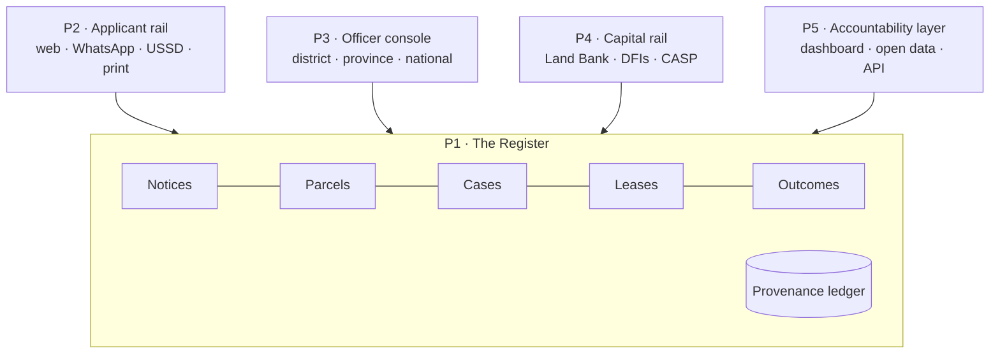
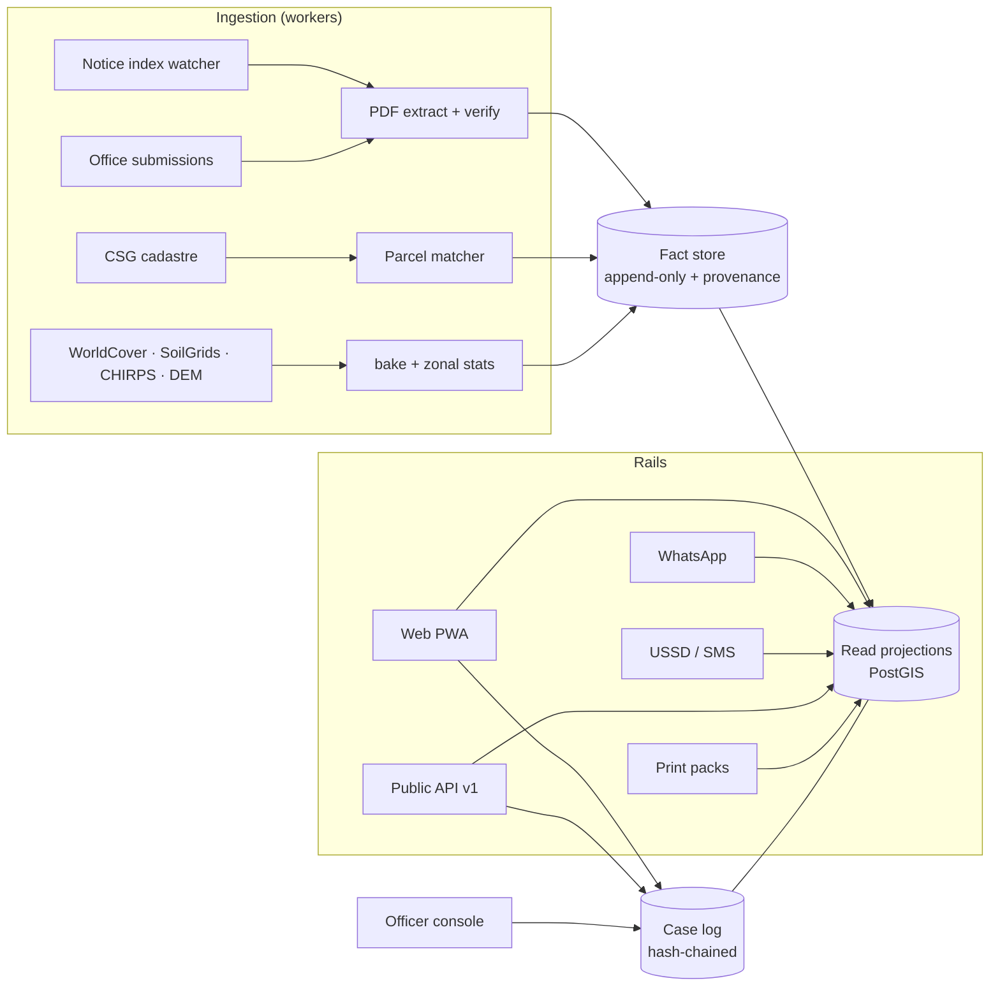

# Asbonge: the 100x plan

The register of record for state agricultural land in South Africa.

Checked against the repository at commit `10fd7fd` (15 Sep 2026): 63 source files, 13 548 lines
under `src`, 22 transcribed notices, 2 cadastrally matched parcels, 33 unit tests, 197.1 kB
first-load JS. Every claim about the app below names the file it came from. Every number about the
land comes from `src/content/`, which carries its own sources and review date
(`CONTENT_REVIEWED = '2026-09-08'`). Numbers introduced by this plan are **targets**, and are
labelled as such. Nothing here licenses invented data — Rule 1 in `AGENTS.md` still holds, and it
holds harder the moment officials rely on us.

This plan sits **after** `docs/PLAN.md`, not instead of it. That plan (Phases 0–6) is the
prerequisite: it makes the code safe to change, puts real data on the model, and gets the
experience to a standard an institution can be shown without apology. This one continues the
numbering at Phase 7.

---

## 0. The short version

The 10x plan makes the best thing in the country to **look at** if you want state farmland.

100x is a different category: the thing the process **runs on**. Not a guide to the system — a
working part of it.

Three shifts do all the work.

1. **From a reader to a register.** Today the app describes the system and transcribes its PDFs.
   It should hold the system's state: every notice ever advertised, every parcel matched to
   cadastre, every application and the pack behind it, every lease, every outcome — each field
   carrying where it came from, when, by what method, and who verified it.
2. **From one audience to four sides of one market.** An applicant tool can be ignored. A register
   that the applicant, the district officer, the lender and the journalist all read from cannot.
   Four sides, one record.
3. **From a website to a rail with many mouths.** Web, WhatsApp, USSD, SMS, print and API. The
   people this is for are often on a 2 GB Android with R10 of airtime, in a place where the office
   is 90 km away. A beautiful WebGL map is not the product; it is one mouth of it.

### The 100x test

> When a DLRRD official, a Land Bank credit officer, a journalist and an applicant all quote the
> same record ID for the same farm, the job is done.

Everything in this plan is scored against that sentence. Anything that does not move it — however
good — waits.

### What changes for a real person

Today: you hear about a farm from a cousin, you find a PDF if you are lucky, you photocopy Form
ALA, you drive to a tender box, you post a sealed envelope into 87 days of silence
(`TOTAL_DAYS` in `src/content/process.ts`), and if you lose you do not learn why.

At 100x: an SMS in Setswana tells you a farm 40 km away has opened and closes on the 21st. You dial
a USSD menu or open a 40 kB page, see the parcel boundary, the grazing capacity the notice claims,
the slope and rainfall we hold, and photos someone took at the gate. The app builds your pack,
names the three documents you are missing, and tells you the scoring rubric it will be measured
against. You submit — on paper if that is the law, with a register ID stamped on it either way.
You get a status when the district committee logs it, when the province reviews it, when national
determines it. If you lose you get the reasons and a pre-filled appeal. If you win, the lease, the
CASP file and the Land Bank application all read the same record, and in a year the register can
say whether the land is being farmed.

---

## 1. Why the 10x plan hits a ceiling

The 10x plan is well made and should be finished. But read its exit state honestly: someone
arrives, opens the country like an anatomy model, drops into real terrain, taps a farm, reads
sourced numbers, and then **leaves the app to do the actual thing**. The boundary is at the tender
box, and nothing the app did crosses it.

Five ceilings, and each one is structural rather than a matter of polish.

| # | Ceiling | Why more polish will not fix it |
|---|---|---|
| 1 | **Read-only.** Nothing a user does is remembered by the institution | No amount of interface quality makes a page an intake channel |
| 2 | **Single-sided.** No official uses it, so no official depends on it | An audience that cannot be switched off is an audience you can ignore |
| 3 | **Derivative data.** It transcribes PDFs from one Joomla index (`NOTICE_INDEX` in `src/content/farm-notices.ts`) | If that folder moves, the app has nothing and no archive to fall back on |
| 4 | **No outcome loop.** The app cannot tell whether anyone who used it got land | Unmeasured help cannot be improved, funded or defended |
| 5 | **Unfalsifiable value.** "A useful reference" is not procurable | Provinces buy or adopt systems of record, not reference sites |

The 10x plan's own scorecard names the symptom without naming the cause: it targets "every usable
notice in the 2026 index … re-checked weekly". The 2026 index is one year of one department's
publishing habit. A register is the cause-level answer.

---

## 2. What the system actually fails at

Seven failures. Each one is a product surface later in this plan. The evidence is in this
repository or in the content files it compiled from government sources.

**F1 · Discovery.** Notices are PDFs behind a Joomla content article. 53 linked 2026 PDFs were
read; 22 notices are in the app; the remaining 31 are not
(`src/content/notice-coverage.json`, `src/content/farm-notices.ts`). All fifteen Northern Cape
notices found had **already closed** by the time they were read. There is no feed, no alert, no
archive of prior years, and no way to know a notice existed if you were not watching that page on
the right week.

**F2 · Location.** Two notices are matched to cadastral boundaries
(`src/data/notice-parcels.json`). Others carry `"district": "District awaiting confirmation"`,
`"municipality": "Not specified in notice"` and `coordinates: null`. One Northern Cape notice
records, correctly and uncomfortably, that "a similarly named cadastral property has a
substantially different area", so its location is withheld. You cannot inspect land you cannot
find, and you cannot budget for land you cannot inspect.

**F3 · Compliance.** Form ALA has five sections and nine document requirements, including a
five-year agricultural business plan, a cash-flow projection with proof of own contribution, and a
SARS Tax Compliance Status PIN (`src/content/process.ts`). Applications are sealed in an envelope
endorsed with the farm name and dropped in a tender box; late submissions are not carried forward.
Most applications die on documents, not on merit — and the current app helps only with an annexure
checklist (`src/components/Preflight.tsx`).

**F4 · Opacity.** The chain is district screening → provincial technical → national selection →
lease, about 87 days as the timeline counts them (`STAGES`, `TOTAL_DAYS`). Written reasons and a
Land Allocation Appeals Committee exist (`src/content/risks.ts`, `'capture'`). The applicant gets
no status, no score, and in practice often no reasons. Selection "has been captured before" is the
repository's own finding.

**F5 · Bankability.** PLAS keeps the title deed in the national register, so the lease is not
security and ordinary production credit is closed (`src/content/risks.ts`, `'tenure'`). Blended
Finance is a departmental grant matched with concessional Land Bank debt, tiered 70/30, 50/50 and
30/70 with caps of R500 000, R1m and R1.5m (`src/content/finance.ts`) — and it needs the same
business plan and own-contribution evidence the applicant could not assemble in F3.

**F6 · The 2024 split.** Land allocation sits with DLRRD; production support sits with DoA
(`src/content/departments.ts`). "Getting the farm does not get you the CASP grant or the extension
officer. Open both files at once and do not assume one department has told the other"
(`src/content/risks.ts`, `'split'`). Two files, no shared record, one farmer carrying the
coordination cost.

**F7 · No national picture.** The 30% redistribution target for 2015 was missed at an estimated
5.5–8% transferred (`src/content/policy.ts`, LRAD). The medium-term target is 200 000 ha for
2024–2029 (`NATIONAL_FIGURES`). Nobody — inside or outside the state — can watch progress against
that farm by farm, in public, as it happens.

Read F1 to F7 together and the shape is obvious. This is not an information problem. It is a
**record-keeping problem wearing an information problem's clothes**.

---

## 3. What "de facto" actually requires

"Preeminent" is won by being better. "De facto" is won by being **structurally difficult to route
around**. Product quality is only the first of five tests.

| Test | What proves it | What we do about it |
|---|---|---|
| **T1 · Canonical** | Other people quote our record ID for a farm | Mint stable public IDs, put them on every page, print them on every pack, never reuse or recycle one |
| **T2 · Complete** | Every notice the department has published, not just the live ones | Archive back through every year the index reaches, hash each PDF, and design the answer for what we do not have |
| **T3 · Mandated** | One province writes us into its process; the department links to us | A free pilot that saves a district officer real hours, then a data-sharing MOU |
| **T4 · Reachable** | It works on a feature phone, in the language spoken where the land is, for cents | USSD and SMS as first-class products; the eleven written official languages; a 50 kB text rail |
| **T5 · Depended on** | Other software calls our API; removing us breaks someone else's workflow | A versioned public API, an open schema, and a published register dump under CC BY |

T1 and T2 we can do alone, starting now, without anybody's permission. T4 we can do alone with
money. T3 and T5 need other people to say yes — which is why T1, T2 and T4 come first. **Be
useful without permission, get cited, then get adopted.** That order is not negotiable; reversing
it is how civic technology dies in a procurement queue.

One more requirement, easy to miss: **being replaceable**. An institution will not build its
process on something it cannot take back. Open-source the client, publish the schema, escrow the
register, and write an exit clause that hands over a full export on request. Paradoxically, making
ourselves safe to drop is what makes us safe to adopt.

---

## 4. Scorecard: today → 10x → 100x

| Measure | Today (`10fd7fd`) | 10x target (`docs/PLAN.md`) | 100x target (this plan) |
|---|---|---|---|
| Notices in the app | 22 | Every usable notice in the 2026 index | Every notice the index reaches, every year, plus office submissions — with a hash of each PDF |
| Historic archive | None | None | A permanent public archive; a closed notice is still a record |
| Parcels located | 2 matched | Every exact cadastral match; any parcel clickable | Every notice either matched, or flagged unmatched with the reason, at a published match rate |
| Notice latency | Manual, weekly at best | Re-checked weekly | Under 24 hours from appearing to published — measured, not asserted |
| What a user can do | Read and plan a route | Read, inspect land, add photos | Assemble a compliant pack, submit, track, appeal |
| Application status | Not a concept | Not a concept | Every case has a state and an append-only log the applicant can read |
| Officials using it | None | None | A district console in one province, then more |
| Financiers using it | None | None | A machine-readable farm and production dossier a credit officer accepts |
| Languages | English | English | The eleven written official languages on the text rail, human-reviewed, plus signed video for the rights and deadlines screens |
| Channels | Web | Web | Web, WhatsApp, USSD, SMS, print, API |
| Lightest usable screen | ~197 kB first load | ~230 kB budget | 50 kB text rail; USSD needs no data at all |
| Public API consumers | 0 | 0 | A versioned API with a published schema and an SLA |
| Provenance | Source note per content file | Sources register + About sheet | Per-field provenance: value, source, retrieved, method, confidence, verifier |
| Outcome data | None | None | Hectares allocated traceable to a register ID; productive-use record at 12 months |
| Accountability output | None | None | A public dashboard against the 200 000 ha 2024–2029 target |
| Availability commitment | None | None | Published uptime target, status page, incident log |

Targets in the right-hand column are commitments this plan proposes, not measurements.

---

## 5. One platform, five products

The register is the product. The other four are mouths on it.



### P1 · The Register — the thing everything else reads

**Who it serves:** every other product, and anyone who cites us.

**Today:** facts live in TypeScript modules (`src/content/*.ts`) and JSON (`src/data/*.json`),
compiled by hand, reviewed on a date. That is the right *discipline* and the wrong *substrate*: it
cannot hold a case, cannot record who verified a field, and cannot be written to by a district
office at 16:00 on a Friday.

**What it becomes:** Postgres with PostGIS in South Africa, holding notices, parcels, farms,
offices, officials, cases, leases and outcomes. Two rules make it a register rather than a
database:

1. **Every field carries provenance.** `value`, `source_id`, `retrieved_at`, `method`
   (`transcribed` · `extracted` · `submitted` · `computed` · `matched`), `confidence`, and
   `verified_by` when a human checked it. Unknown stays null and renders "Not recorded" — the rule
   the content layer already keeps, now enforced by a column.
2. **Nothing is overwritten.** Facts are appended; the current view is a projection. A notice
   withdrawn is not a notice deleted — the repository already holds
   `Notice-withdrawal-Zandfontein-Advert.pdf` in its reviewed list, and that withdrawal is itself a
   fact worth keeping.

**The hard part:** migrating without losing the honesty. The content files are the seed and stay
the source of truth for policy prose; the register takes over the things that change per farm and
per person.

### P2 · The Applicant Rail

**Who it serves:** the person who wants land, on the device and in the language they have.

**Today:** a four-answer pathfinder producing typed blocks (`src/lib/pathfinder.ts`,
`src/lib/blocks.ts`), an annexure checklist (`Preflight.tsx`), an SG-code length validator that
cannot look anything up (`SgCode.tsx`), and a farm budget calculator (`src/lib/farm-budget.ts`).

**What it becomes:** a pack compiler. It knows the nine document requirements and the five form
sections, holds your documents encrypted, tells you exactly what is missing, generates a business
plan and cash-flow **structure** you fill in (never invented content), produces a print-ready pack
with a register ID and a covering index, and — where a province accepts it — submits digitally.
Then it tracks: logged, screened, reviewed, determined, lease issued. Then, if needed, it builds
the appeal from the written reasons and the rubric.

**The hard part:** a business plan is the applicant's own commercial judgement. We supply
structure, worked examples from published enterprise budgets with their sources, and arithmetic.
We never write the plan, and we never say "you qualify" — we say what the policy says.

### P3 · The Officer Console

**Who it serves:** the district and provincial officials named in `src/content/provinces.ts`, who
today run screening committees out of spreadsheets and envelopes.

**Today:** nothing. The app shows their names and phone numbers.

**What it becomes:** intake and adjudication support. Applications arrive indexed and
compliance-checked, so the district committee spends its time on merit instead of sorting paper.
The rubric is entered once and applied to all; scores, interview notes and reasons are captured
against the case; the appeals trail is automatic; the province sees its own pipeline and where it
is stuck. Every action is written to a hash-chained log the applicant, the auditor and the
Auditor-General can read.

**The hard part and the red line:** we support the decision, we never make it. No ranking the
console produces may be shown without the rubric that produced it. Auto-shortlisting is not a
feature we will build, because a score nobody can interrogate is exactly the capture risk
`risks.ts` already names.

### P4 · The Capital Rail

**Who it serves:** the lessee who cannot borrow, and the credit officer who cannot lend.

**Today:** the Blended Finance tiers as content (`src/content/finance.ts`).

**What it becomes:** the lease may not be security, but a verified production record is
information, and information prices risk. A farm dossier — parcel, soil, rainfall, infrastructure
distances, lease terms, dated field photos, satellite greenness history — exported as a signed,
machine-readable credit file with every field's provenance attached, at the lessee's instruction
and with their consent. Plus the CASP and Ilima-Letsema files opened in the same motion, which is
the F6 fix.

**The hard part:** this is the surface where we could do real harm. A "bankability score" we
compute becomes a reason to decline a loan. So: no opaque scores, no automated decisions, the
lessee sees and controls every export, and the dossier carries what the data cannot tell you as
prominently as what it can.

### P5 · The Accountability Layer

**Who it serves:** journalists, researchers, Parliament's portfolio committee, farmer
organisations, and the public that owns this land.

**Today:** nothing.

**What it becomes:** a public dashboard of notices, allocations and hectares against the
200 000 ha 2024–2029 target; the full register as a downloadable dump under CC BY 4.0; a versioned
API; and a method note explaining every denominator. This is also our defence: a register that
publishes its own coverage gaps is hard to accuse of spin, and hard to quietly capture.

---

## 6. Architecture



**Substrate.** Postgres 17 + PostGIS, hosted in South Africa (`af-south-1` or a local provider),
with point-in-time recovery and a nightly encrypted export to separate custody. The Next.js app
stays; it becomes one client of the register rather than the whole system. Workers run as scheduled
jobs, not in request handlers.

**Why not keep it in the repo.** Because a register takes writes from people who do not have commit
access, and because "reviewed on 8 September" cannot be the freshness guarantee for a deadline that
closes on the 21st.

**The provenance ledger** is the single most important design decision in this plan, so it gets a
shape here and a schema in Appendix A:

```
fact(id, subject_type, subject_id, field, value_json,
     source_id, method, retrieved_at, confidence,
     verified_by, verified_at, superseded_by, created_at)
source(id, kind, url, title, publisher, retrieved_at, sha256, bytes, licence, notes)
```

A page that shows a hectare figure can therefore always answer: from which PDF, downloaded when,
extracted how, checked by whom. That is what makes a number citable, and citation is what makes a
register canonical (T1).

**The case log** is append-only and hash-chained: each event stores the hash of its predecessor, so
a missing or edited event is detectable. Events are typed (`submitted`, `logged`, `screened`,
`scored`, `interviewed`, `recommended`, `determined`, `lease_issued`, `appealed`). The applicant
reads their own chain; the officer reads their district's; nobody edits history.

**AI, with citation discipline.** Five uses, each behind the same rule: **a model may only surface
a claim that resolves to a register row, or it must say it does not know.** No free generation into
a legal surface.

| Use | Input | Output | Human gate |
|---|---|---|---|
| Notice extraction | Notice PDF text and layout | Draft field values with per-field confidence | Nothing publishes below a confidence floor without a human verifier |
| Translation | Published English strings | Draft translations in the other ten written languages | A human reviewer per language before publication |
| Applicant coach | Question + register + policy content | Answer with citations to record IDs | Refuses when no citation exists; never gives legal advice |
| Land screening | Geodata for a parcel | Sourced numbers with resolution and date | Never a suitability verdict; the app's existing stance, kept |
| Oversight signals | Allocation patterns in the register | Flagged anomalies for human review | Never an accusation; a question for a journalist or auditor |

**Non-negotiables.** Data residency in South Africa. No personal information in logs or in any
third-party model prompt. Secrets from the environment only (Rule 4). Every external call keeps the
existing discipline from `src/app/api/` — validate input against South African bounds, time out
within 10 s, cap the payload, set cache headers, return a message a person can act on. Offline
writes reconcile with server-wins on facts and client-preserved on drafts, and a conflict never
silently discards what a person typed.

---

## 7. The roadmap

Three horizons. Task format matches `docs/PLAN.md`: **ID · title · size · tags**, where **S** is
one or two files, **M** is two to six, **L** is a new module or a large refactor. Tags: **deep**
(maths, security or a big refactor — use your strongest model and read the diff line by line),
**you** (needs a person: an account, a key, a signature), **legal** (needs counsel or an
information officer), **partner** (needs someone outside to say yes).

> **Rule of the loop, unchanged:** a task is not done until its Check passes. One task, one diff,
> one commit. If a task seems to need invented data to look finished, stop.

### Horizon 1 (months 0–6): be useful without permission

Nothing here needs a signature from anybody. It is all T1, T2 and T4. At the end of H1 we are the
holding a complete, hashed, public archive of every notice the department's index reaches,
reachable from a feature phone and citable by anyone.

---

#### Phase 7: The register

Goal: the app reads from a register with per-field provenance instead of hand-compiled modules, and
the migration loses none of the current honesty.
Exit demo: a notice page shows a hectare figure; clicking its provenance chip names the PDF, its
SHA-256, the download date, the extraction method and the human who verified it.

**P7.1 · Decisions and accounts · S · you**
- **Do:** choose and provision the register host (managed Postgres 17 + PostGIS in South Africa),
  object storage for source PDFs, and a job runner. Record the choice, the region, the cost per
  month and the exit path in `docs/decisions/0001-register-host.md`.
- **Check:** `psql` connects from a Codespace using an environment variable; `SELECT postgis_version()` works.
- **Done when:** no credential is in the repo and `docs/decisions/0001-register-host.md` names the region and the exit path.

**P7.2 · Schema and migrations · L · deep**
- **Files:** new `db/migrations/0001_register.sql`, `db/README.md`, `src/register/schema.ts`.
- **Do:** create `source`, `fact`, `notice`, `parcel`, `farm`, `office`, `official` with the shapes
  in Appendix A. PostGIS geometry in EPSG:4326 with a GiST index. `fact` is append-only: a trigger
  refuses `UPDATE` and `DELETE` except setting `superseded_by`.
- **Check:** migrations apply to an empty database and are idempotent; a test that tries to update a
  fact row fails with the trigger's message.

**P7.3 · Provenance API · M · deep**
- **Files:** new `src/register/facts.ts`, `src/register/provenance.ts`, `tests/provenance.test.ts`.
- **Do:** `putFact()`, `currentValue(subject, field)` (latest non-superseded), and
  `provenanceOf(subject, field)` returning the full chain. No component may read a value without
  being able to reach its provenance.
- **Check:** unit tests for supersession ordering, null handling ("Not recorded") and a two-hop chain.

**P7.4 · Seed from the content layer · M**
- **Files:** new `scripts/register/seed.mjs`.
- **Do:** load the 22 notices, the 2 matched parcels, the 9 provinces and their officials into the
  register, each with a `source` row for the PDF or directory it came from and `method` of
  `transcribed`. `CONTENT_REVIEWED` becomes the `retrieved_at` where nothing more precise exists.
  Policy prose stays in `src/content/`.
- **Check:** seeding twice produces the same current values and no duplicate sources; a count query returns 22 notices.

**P7.5 · Read path behind an interface · M · deep**
- **Files:** new `src/register/read.ts`; edit `src/lib/source.ts`, `src/app/api/parcels/route.ts`.
- **Do:** one interface with two implementations — `register` and `content` (today's modules) —
  chosen by `REGISTER_URL`. Without the variable the app behaves exactly as it does now. The
  dependency graph rule stays: `src/register` never imports components.
- **Check:** `npm run check` passes with and without `REGISTER_URL`; `npm run e2e` passes in both modes.

**P7.6 · Provenance chip in the interface · M**
- **Files:** new `src/components/ui/Provenance.tsx`; edit the notice and parcel cards.
- **Do:** a chip under every figure that opens the chain: source title, publisher, retrieved date,
  SHA-256 (first 12 characters, with a copy action), method, confidence, verifier. Unverified
  extractions are labelled, not hidden.
- **Check:** a Playwright test asserts every rendered figure on a notice card has a reachable provenance chip.

**P7.7 · Backup, restore and residency · M · deep**
- **Files:** new `scripts/register/backup.mjs`, `docs/runbooks/restore.md`.
- **Do:** nightly encrypted dump to separate custody; a documented restore rehearsed end to end and
  timed. The runbook names the region every copy lives in.
- **Check:** a restore into a scratch database reproduces the row counts; the runbook records the measured restore time.

---

#### Phase 8: The archive

Goal: every notice the department's index reaches, every year, permanently recorded and hashed —
plus a published match rate and a published list of what we could not resolve.
Exit demo: search "Zandfontein" and get the advert, its withdrawal, both PDFs by hash, and the
dates each was seen.

**P8.1 · Index watcher · M**
- **Files:** new `workers/notices/watch.mjs`, `db/migrations/0002_index_snapshots.sql`.
- **Do:** fetch the index hourly, diff the link set against the last snapshot, store every new or
  changed PDF to object storage with its SHA-256, and open an extraction job. Store a snapshot even
  when nothing changed, so "we were watching" is itself a record. Respect robots and rate limits;
  identify the client honestly in the user agent.
- **Check:** a replayed pair of fixture index pages produces exactly one new notice job and two snapshots.

**P8.2 · Extraction with confidence · L · deep**
- **Files:** new `workers/notices/extract.mjs`, `workers/notices/fields.ts`, `tests/extract.test.ts`.
- **Do:** `pdftotext -layout` first; fields by labelled patterns (farm name, portion, LPID, hectares,
  land-use split, stocking capacity, closing date and time, contact, priority category, office).
  Every field gets a confidence. A model drafts only the fields the deterministic pass could not
  resolve, and its output is never published unverified.
- **Check:** against the 22 already-transcribed notices as ground truth, closing date and hectares
  match on at least 20; every mismatch is listed in the report rather than silently dropped.

**P8.3 · Verification queue · M**
- **Files:** new `src/app/(admin)/verify/page.tsx`, `src/app/api/verify/route.ts`.
- **Do:** side-by-side PDF and extracted fields; a verifier accepts, corrects or rejects each field;
  acceptance writes `verified_by` and `verified_at`. Nothing below the confidence floor reaches the
  public rails without passing through here.
- **Check:** verifying a fixture notice moves it from `pending` to `published` and writes the verifier to the fact row.

**P8.4 · Historic sweep · M · you**
- **Do:** walk the index back through every year it reaches, plus the Internet Archive for pages the
  department has since removed. Record each year's completeness honestly in
  `src/content/notice-coverage.json`'s successor table: reachable, unreachable, and why.
- **Check:** the coverage table names every year attempted with a count and a status; the unreachable list is non-empty and explicit if that is the truth.

**P8.5 · Parcel matcher with a published rate · L · deep**
- **Files:** new `workers/parcels/match.mjs`, `docs/data/match-report.md`.
- **Do:** match notices to CSG cadastre on farm name, portion, LPID and area. A match requires name
  agreement **and** area within a stated tolerance; anything else is `unmatched` with a reason
  code, never a guess. Publish the rate and the reasons.
- **Check:** the two existing matches reproduce exactly; the Aasvogelpan area conflict resolves to `unmatched: area-conflict`, not to a location.

**P8.6 · Office submissions · M · partner**
- **Files:** new `src/app/(admin)/submit-notice/page.tsx`.
- **Do:** a route for a district office to upload a notice PDF directly, with the same hashing,
  extraction and verification path. This is the beginning of T3: the first thing we ever ask an
  official for is a favour that saves them a phone call.
- **Check:** an uploaded fixture PDF lands in the queue with `method: submitted` and its source hash recorded.

**P8.7 · Notice pages and preview cards · M**
- **Files:** new `src/app/notice/[id]/page.tsx`, `src/app/notice/[id]/opengraph-image.tsx`.
- **Do:** a server-rendered, printable page per notice carrying the register ID, the parcel map when
  matched, the deadline, the office, the provenance for every field, and a link to the original PDF
  by hash. A generated preview card for WhatsApp.
- **Check:** the page renders for a closed notice and for an unmatched one without a map, and prints on one page.

---

#### Phase 9: Reach

Goal: a person with a feature phone, no data and no English can find a farm and a deadline.
Exit demo: a USSD session on a test line returns three open notices within 50 km of a chosen
municipality, in Setswana, and sends an SMS with the register ID and the office number.

**P9.1 · The text rail · L**
- **Files:** new `src/app/t/[...slug]/page.tsx`, `src/styles/text-rail.css`.
- **Do:** a parallel no-JavaScript rail: server-rendered HTML, system fonts, no images above 10 kB,
  no map, under 50 kB per screen including markup. Every explorer screen has a text-rail
  equivalent, and every text-rail page links to the rich one.
- **Check:** a test asserts each text-rail route is under 50 kB and renders with JavaScript disabled.

**P9.2 · Language infrastructure · M · deep**
- **Files:** new `src/i18n/`, `src/i18n/catalog.ts`, `tests/i18n.test.ts`.
- **Do:** message catalogues keyed by string ID for the eleven written official languages, with a
  `reviewed_by` field per language per release. An unreviewed string falls back to English visibly
  rather than shipping an unchecked translation of a legal deadline.
- **Check:** a test fails if a published locale has an unreviewed string in a legal surface (deadlines, exclusions, rights).

**P9.3 · First four languages · M · you**
- **Do:** commission human review for Setswana, Sepedi, isiXhosa and Afrikaans first — chosen
  because North West, Limpopo, the Eastern Cape and the Northern Cape are where the advertised
  hectares are (`src/content/provinces.ts`). Machine drafts, human reviews, reviewer is named.
- **Check:** all four locales pass P9.2's test; a native speaker sign-off is recorded per locale in `docs/i18n/reviews.md`.

**P9.4 · SMS deadline alerts · M · you**
- **Files:** new `workers/alerts/send.mjs`, `src/app/api/subscribe/route.ts`.
- **Do:** subscribe by province, district or radius. One message when a notice opens, one at seven
  days, one at 48 hours. Strict opt-in, one-word opt-out, a hard cap per person per week, and no
  message that costs the recipient anything to receive.
- **Check:** a fixture run produces exactly three messages for one notice and none after opt-out; the cap is enforced in a test.

**P9.5 · USSD menu · L · you · partner**
- **Files:** new `src/app/api/ussd/route.ts`, `src/ussd/menu.ts`, `tests/ussd.test.ts`.
- **Do:** a stateless menu over an aggregator's callback: province → district → open notices →
  one notice's essentials → "SMS me this". Every screen inside the character limit, in the chosen
  language, in under 3 seconds.
- **Check:** a simulated session reaches a notice in four steps; a test asserts no screen exceeds the limit in any published locale.

**P9.6 · WhatsApp channel · M · you**
- **Files:** new `src/app/api/whatsapp/route.ts`.
- **Do:** a Business account that answers a farm name, a register ID or a shared location with the
  notice essentials and the office number, and offers alerts. Template messages only for
  outbound, so nobody is spammed.
- **Check:** an inbound fixture returns the notice card; an unknown query returns the honest "not in the register" reply, not a guess.

**P9.7 · Offline and cheap · M**
- **Files:** new `src/app/sw.ts`, `src/lib/offline.ts`.
- **Do:** a service worker that caches the text rail, the user's province's open notices and their
  own drafts. A visible data-saving mode. An honest offline banner with the age of what you are
  reading.
- **Check:** a Playwright run in offline mode still shows the cached notices with an age label and refuses to show a deadline it cannot confirm.

**P9.8 · Accessibility audit · M**
- **Do:** WCAG 2.2 AA across both rails, screen-reader tables for every chart (already an
  `AGENTS.md` rule), 44 px targets, `prefers-reduced-motion`, and one session with a low-literacy
  reader whose findings are written up and acted on.
- **Check:** an automated axe pass with zero criticals on every route, plus `docs/a11y/findings.md` with what changed.

---

### Horizon 2 (months 6–18): get adopted

Now other people have to say yes. The order is deliberate: give an officer something that saves
them hours before asking them to depend on us.

---

#### Phase 10: The applicant rail

Goal: from "I want this farm" to a complete, compliant, printed pack with a register ID.
Exit demo: on a phone, choose an open notice, answer the questions, upload four documents, and get
a print-ready pack that names the two annexures still missing.

**P10.1 · Accounts, kept small · M · deep · legal**
- **Do:** sign-in by emailed or texted code. Store the minimum: a contact, a locale, a district.
  Never store an ID number unless a submission requires it, and then encrypted at rest with a
  retention date. Write the POPIA purpose and retention schedule before the first row exists.
- **Check:** a delete request removes or anonymises every row in one operation, proven by a test; `docs/legal/popia-record.md` exists and names the information officer.

**P10.2 · Document vault · L · deep**
- **Do:** encrypted document storage, virus scanned, EXIF stripped, per-user quota, signed URLs with
  short expiry. Documents are the applicant's, not ours: export and delete are first-class actions.
- **Check:** a test proves a signed URL expires and that another user cannot read a document by ID.

**P10.3 · The pack compiler · L**
- **Do:** from the notice and the applicant's answers, produce the Form ALA cover, the annexure index
  with the register ID, and a gap list naming each missing requirement from `DOCUMENTS` in
  `src/content/process.ts`, with where to get it (SARS TCS PIN, CIPC certificate, commissioner of oaths).
- **Check:** an individual applicant and an entity applicant produce correctly different gap lists; a golden-file test pins both PDFs.

**P10.4 · Business plan and cash-flow structure · L**
- **Do:** the skeleton, the arithmetic and worked enterprise budgets **with their published
  sources** — never invented content, never a plan written for the applicant. Every assumption the
  applicant enters is theirs and labelled as theirs.
- **Check:** the generated document contains no figure that is neither entered by the user nor traceable to a cited source; a test enforces it.

**P10.5 · Eligibility, stated as the policy states it · M**
- **Do:** extend `src/lib/pathfinder.ts` to run the `EXCLUSIONS` in `src/content/process.ts` against
  the applicant's answers and return blockers with the rule, the severity and the date a cooling-off
  period clears. Wording is always "the policy says", never "you qualify".
- **Check:** a test for each exclusion; a test that no output string contains a first-person verdict.

**P10.6 · The rubric, published · M · partner**
- **Do:** capture the scoring criteria as they appear in each advert, show the applicant what they
  will be measured on before they apply, and let them self-assess against it. If an advert does not
  publish its criteria, say so — that absence is a finding.
- **Check:** a notice with published criteria shows them; one without shows the honest gap and the right to request them.

**P10.7 · Submission and tracking · L · deep · partner**
- **Do:** where a province accepts digital submission, submit and record the receipt. Where it does
  not, print the pack with the register ID and record a self-reported "posted on" date. Either way
  the case exists, the chain starts, and the applicant can see it.
- **Check:** both paths produce a case with a hash-chained first event; the printed path is explicitly marked self-reported.

**P10.8 · Reasons and appeals · M · legal**
- **Do:** on an unsuccessful determination, show the reasons recorded against the case and generate
  the appeal to the Land Allocation Appeals Committee, with the deadline and the address. Where no
  reasons were recorded, generate the request for them instead — that is the applicant's entitlement
  (`src/content/risks.ts`, `'capture'`).
- **Check:** both branches produce a correct document; a test asserts the appeal names the committee and the statutory window.

---

#### Phase 11: The officer console

Goal: one district office runs a real screening round on the console and finishes sooner than it
would have on paper.
Exit demo: a district officer opens a closed notice, sees every application indexed and
compliance-checked, records scores against the published rubric, and exports the committee minute.

**P11.1 · Pilot agreement · S · you · partner · legal**
- **Do:** one province, one district, free, time-boxed, with a named official, a written scope, a
  data-sharing agreement and an exit clause that returns every record on request. Choose a district
  with live notices rather than the province where the evidence is best — all fifteen Northern Cape
  notices reviewed had already closed (`src/content/notice-coverage.json`).
- **Check:** a signed agreement exists; `docs/partners/pilot-01.md` records scope, data terms, exit and the success measure the official chose.

**P11.2 · Roles and access control · L · deep**
- **Do:** roles for applicant, verifier, district officer, provincial officer, moderator and auditor,
  enforced in the database with row-level security, not only in the interface. An auditor can read
  everything and change nothing.
- **Check:** a test matrix proves every role against every table; a district officer cannot read another district's cases.

**P11.3 · Intake queue · L**
- **Do:** applications per notice, grouped, with the compliance state of each pack, flags for missing
  documents, and the original PDF one click away. Sort by nothing that implies a merit ranking.
- **Check:** a fixture round of 40 applications loads under 2 seconds and shows correct compliance counts.

**P11.4 · Scoring against the rubric · L · deep**
- **Do:** the officer enters the advert's rubric once; the console applies it to every application,
  records each score with who entered it and when, and refuses to produce a total until every
  criterion is scored. No weighting we invented, ever.
- **Check:** a test proves an incomplete scoring set yields no total and no rank; every score writes an event.

**P11.5 · Committee minute and reasons · M**
- **Do:** generate the district committee's minute — attendance, applications considered, scores,
  recommendation, and the reasons per unsuccessful applicant — as the record the process already
  requires. Reasons written here are what the applicant reads in P10.8.
- **Check:** a golden-file test on the minute; a test that no applicant can be recommended without a recorded reason for each one who was not.

**P11.6 · The audit bundle · M · deep**
- **Do:** export a tamper-evident bundle for one notice: every event, every hash, every document
  digest, every fact's provenance, with a verification script anyone can run.
- **Check:** the verifier passes on a clean bundle and fails loudly on a single altered byte.

**P11.7 · The two-department file · M · partner**
- **Do:** on a lease being issued, open the production-support side in the same motion — the CASP
  and Ilima-Letsema requirements, the provincial extension contact, and one shared record both
  departments can read. This is the F6 fix, and it is the reason a DoA official would ever want us.
- **Check:** a lease event produces the support checklist with the correct provincial contacts from the register.

---

#### Phase 12: Accountability

Goal: anybody can see the national picture and check our arithmetic.
Exit demo: a journalist downloads the full register, reproduces the dashboard's hectare total from
the dump, and finds our published coverage gaps listed before they have to ask.

**P12.1 · Public API v1 · L · deep**
- **Do:** versioned, documented, rate-limited, read-only: notices, parcels, offices, aggregates.
  Cursor pagination, ETags, a deprecation policy, and a changelog. Never any personal information.
- **Check:** a contract test suite pinned to the published OpenAPI document; a test proves no case or applicant field is reachable.

**P12.2 · Open register dump · M · legal**
- **Do:** nightly CSV, GeoJSON and JSON-LD under CC BY 4.0, with a checksum, a schema version and a
  method note. Third-party source licences are honoured and stated per field.
- **Check:** the dump validates against the published schema; a licence audit lists every field's upstream terms.

**P12.3 · The public dashboard · L**
- **Do:** notices published, notices closed, hectares advertised, hectares allocated where we can
  verify it, against the 200 000 ha 2024–2029 target from `src/content/policy.ts`. Every chart
  labelled directly, units on axes, source and date underneath, numbers offered as a table.
- **Check:** every figure on the dashboard is reproducible from the public dump by a script in the repo.

**P12.4 · Coverage and honesty page · M**
- **Do:** a permanent page stating what the register does **not** have: years unreachable, notices
  unmatched and why, fields below the confidence floor, provinces we are thin in. Updated
  automatically, not by hand.
- **Check:** the page's counts are generated from queries; a deliberately withheld fixture appears on it within one build.

**P12.5 · Oversight signals · M · deep · legal**
- **Do:** surface patterns worth a human question — the same contact across unrelated adverts, a
  deadline shorter than the norm, an allocation to a category the advert excluded. A question, never
  an accusation, never a named individual without a human editorial decision.
- **Check:** every signal renders with its method, its false-positive caveat and the register rows behind it; a test blocks publication of a signal without all three.

---

### Horizon 3 (months 18–48): become the rail

---

#### Phase 13: The capital rail

Goal: a verified production record turns into credit the lease could never secure.

**P13.1 · Lease and performance register · L · partner**
- **Do:** lease terms, rental basis (`RENTAL_FORMULA`, `src/content/categories.ts`), review dates and
  performance reporting as register records — which also protects a lessee against an
  underutilisation finding they have evidence against.
- **Check:** a lease renders its full term with provenance; a performance report writes an event.

**P13.2 · Productive-use evidence · L · deep**
- **Do:** dated field photos, satellite greenness history and infrastructure state, assembled into a
  record the lessee owns and controls. Every series carries its resolution, date and what it cannot tell you.
- **Check:** a parcel with no usable imagery renders the designed empty state rather than an inference.

**P13.3 · The credit file · L · deep · legal · partner**
- **Do:** a signed, machine-readable export of the farm dossier at the lessee's instruction, with
  per-field provenance, for a lender they name. Consent is explicit, scoped, time-limited and revocable.
- **Check:** an export without a live consent record fails; the consent log is complete and exportable to the lessee.

**P13.4 · Blended finance and CASP application flows · M · partner**
- **Do:** the tiers in `src/content/finance.ts` as a working application path, pre-filled from the
  register, with the own-contribution evidence the scheme requires.
- **Check:** each tier's pack generates correctly for a fixture lessee, including the cap and the grant/loan split.

**P13.5 · No hidden scores · S · deep**
- **Do:** a standing constraint, enforced in code review and in a test: nothing this platform exports
  to a lender may contain a composite score we invented. Fields and provenance only.
- **Check:** a schema test rejects any exported field not present in the published dossier schema.

---

#### Phase 14: The standard and the institution

Goal: the schema outlives us, and so does the register.

**P14.1 · Land Notice Schema v1 · M · partner**
- **Do:** publish the schema in Appendix A as a versioned JSON Schema with a licence, a changelog and
  a reference validator. Invite the department, provinces, universities and farmer organisations to comment.
- **Check:** the validator passes on the full dump; at least one external party has filed a comment on the record.

**P14.2 · Certification of a compliant feed · M · partner**
- **Do:** a test suite anyone can run against their own feed to claim compliance, so a province
  publishing its own notices in the schema becomes interoperable with us rather than dependent on us.
- **Check:** the suite passes on our own API and fails on a fixture feed with a missing required field.

**P14.3 · Legal home and escrow · M · you · legal**
- **Do:** a non-profit company with a public-interest mandate, a board with a farmer-organisation
  seat, register escrow, and a published wind-down plan that hands the data to a named custodian.
- **Check:** registration documents exist; `docs/governance/wind-down.md` names the custodian and the trigger conditions.

**P14.4 · Handover readiness · M · deep**
- **Do:** a documented, rehearsed handover: schema, migrations, workers, runbooks and a full export
  the department could run itself. Being genuinely handoverable is the strongest argument for adoption.
- **Check:** a fresh environment stands the register up from the repository and a dump in under a day, timed and written down.

---

## 8. The standards play

A register becomes canonical when other people's tools break without it. Schemas are how that
happens, and they are cheap to publish and hard to displace.

1. **Publish the schema before anyone asks.** Appendix A, versioned, CC BY 4.0, with a reference
   validator.
2. **Publish the data in it.** A nightly dump is a standing invitation to build on us.
3. **Make compliance testable.** P14.2 gives a province a way to be interoperable without being
   dependent — which is exactly why they will use the shape we chose.
4. **Cite record IDs everywhere.** On pages, in packs, in SMS, in print. An ID that appears on a
   printed pack in a district office is an ID that gets quoted back.
5. **Never break an ID.** A record ID is permanent, even for a withdrawn notice. Especially for a
   withdrawn notice.

---

## 9. The last mile

**Language.** South Africa has twelve official languages since the 2023 constitutional amendment.
Eleven are written; the twelfth, South African Sign Language, is not, so it is served by signed
video on the screens that carry rights and deadlines rather than by a message catalogue. The eleven
written languages go on the text rail, sequenced by where the advertised hectares are. Machine-drafted, human-reviewed, reviewer named per language per release. A legal
surface — a deadline, an exclusion, a right of appeal — never ships an unreviewed translation; it
falls back to English visibly, with an apology and the office number.

**Channels.** Web PWA for the connected. WhatsApp for the majority. USSD and SMS for the feature
phone. Print for the office and the applicant who will hand-carry it. API for everyone building
something else. Radio scripts and one-page posters for extension officers and Farmer Production
Support Units — the channel that reaches a person with no phone at all.

**Cost.** 50 kB per text-rail screen. No web fonts on that rail. USSD costs the user cents and no
data. Approach the networks for zero-rating once the register is worth zero-rating; until then,
assume nothing.

**Devices.** Test on a real low-end Android on a throttled connection, in the loop, not once. The
existing pixel-ratio caps, economy mode and lazy DEM are the right instincts and stay.

**Accessibility.** WCAG 2.2 AA, 44 px targets, reduced motion, screen-reader tables for every
chart. Plus a thing audits do not cover: sit with someone who has never applied and watch them
fail, then fix what made them fail.

---

## 10. Trust: what lets an institution say yes

| Area | What we do | Task |
|---|---|---|
| POPIA | Named information officer, lawful basis and purpose per field, retention schedule, data-subject requests answered in one operation, no personal data in any model prompt | P10.1 |
| PAIA | A published manual and a request route | P10.1 |
| Security | Threat model, SAST and dependency scanning in CI, secrets from the environment only, signed URLs, row-level security, an external penetration test before any official pilot, a disclosure policy and an incident runbook | P11.2 |
| Audit | Hash-chained events, per-field provenance, a tamper-evident export bundle and a verifier anyone can run | P11.6 |
| Model governance | A model card per AI use, a confidence floor, a human gate on every legal surface, logged inputs and outputs for review, and no model claim without a citation | §6 |
| Procurement | Free at pilot scale so nothing waits on a tender; then the smallest lawful instrument — an MOU and a data-sharing agreement before a contract | P11.1 |
| Service | A published uptime target, a status page, support hours, an escalation path, and an exit clause that returns every record | P7.7, P14.3 |

The blunt version: an official's career risk is the real currency. Every item above exists to make
saying yes to us less risky than saying no.

---

## 11. The order of yeses

1. **Nobody.** Publish the archive, the API and the text rail. Be the most complete record that
   exists. (H1)
2. **The cited.** Journalists, researchers, farmer organisations and land-rights NGOs, who need a
   source and will name it. Give them the dump, the method note and the coverage gaps. (P12.2, P12.4)
3. **One district.** A single office, free, time-boxed, with a named official whose own success
   measure we adopt. Save them hours on one screening round. (P11.1)
4. **One province.** The Provincial Shared Service Centre, on the strength of the district's word.
   (Phase 11)
5. **The department.** A data-sharing MOU and a link from the notice index — which, if we have done
   Phase 8 properly, is us offering them a better archive of their own publications than they hold.
6. **The Land Bank and the DFIs.** They need information to price risk, and we will hold the only
   verified production record in the country. (Phase 13)
7. **National, and the standard.** (Phase 14)

**What we never do, at any step.** Never charge an applicant. Never sell or share applicant data.
Never let an official see a ranking whose rubric is hidden. Never become the only channel — the
paper route stays printed and the office stays named. Never claim a legal outcome. Never publish a
person's personal information because it happened to be in a PDF.

---

## 12. Governance, funding and shape

**Legal home.** A non-profit company with a public-interest mandate, a board seat for a farmer
organisation, and the register in escrow with a published wind-down plan (P14.3). A register of
public land holdings should not be able to be sold.

**Funding ladder.** Grants and philanthropy for H1. Provincial support and integration contracts in
H2 — paid by institutions, never by applicants. A lender API and institutional analytics in H3.
Structurally forbidden: applicant fees, data sales, advertising, and any arrangement that pays us
more when more people apply.

**Shape.** H1: three or four people — one engineer on the register and workers, one on the rails, a
verifier who is also the domain owner, and a part-time counsel. H2 adds a partnerships lead who has
sat in a district office, a second engineer, and per-language reviewers on contract. H3 adds
support, data engineering and a compliance function. The verifier role never disappears and never
becomes a model.

**Open source.** The client is open. The schema is open. The dumps are open. The register's
personal data never is.

---

## 13. Measurement: the outcome ledger

Vanity metrics are how a civic project convinces itself it is working. These are the ones that hurt
when they are bad. Denominators published, method note attached, updated automatically.

| Measure | Target | Why it is honest |
|---|---|---|
| Notices published within 24 h of appearing on the index | ≥ 95% | Directly answers F1; measured against index snapshots, not our own diligence |
| Notices in the register with a closing date still in the future when first published | ≥ 90% | The Northern Cape sweep found fifteen notices all already closed. This is the number that must not repeat |
| Notices matched to a cadastral parcel | Published rate, rising | A rate we publish including failures cannot be gamed |
| Median days from notice publication to first applicant view | Falling | Reach, not traffic |
| Applications submitted with a fully compliant pack | ≥ 80% of packs the compiler built | F3, measured at the point of failure |
| Applicants who received written reasons when unsuccessful | ≥ 90% on console districts | The entitlement the process already grants |
| Days from advert close to lease signed | Falling from the 87-day baseline in `process.ts` | The number an official also wants to move |
| Hectares allocated traceable to a register ID | Rising toward the 200 000 ha 2024–2029 target | F7, in public, farm by farm |
| Allocated farms with a productive-use record at 12 months | Published | The question nobody currently asks |
| Text-rail share of sessions | Reported, not minimised | If it is small, we have failed T4, not succeeded at design |

Reported alongside, always: coverage gaps, match failures, unreviewed locales, and every measure we
promised and could not yet compute.

---

## 14. Risks, and how not to become the problem

| Risk | Guardrail |
|---|---|
| **Publishing locations exposes land** to invasion, theft of infrastructure, or speculation | Parcel geometry is public only where the notice itself is public and the match is confirmed; unmatched stays unmatched; infrastructure detail on an occupied farm is authenticated, and a takedown route exists |
| **We become a gatekeeper** — the digital route quietly becomes the only route | The paper route is printed on every pack; the office address and phone number appear on every notice page; never an exclusive intake agreement |
| **Digital exclusion by design** | The text rail, USSD and print are first-class products with their own budgets and their own reported share, not fallbacks |
| **We get captured** | Open rubric, hash-chained log, auditor role that can read everything and change nothing, no private allocation features, no paid placement |
| **We over-claim** and someone loses a farm | "The policy says", never "you qualify". No suitability verdicts without soil tests — the app's existing stance, kept. No legal advice |
| **A model invents a deadline** | Confidence floor, human verification before publication, no model output on a legal surface without a citation, and a test that enforces it |
| **Photos harm people** | Consent, faces and plates blurred, EXIF stripped, moderation before publication, reports and takedown — the Phase 5 rules in `docs/PLAN.md`, kept |
| **Officials' personal details** are republished at scale | Publish office contacts, not personal numbers, unless the department published them as the contact for that advert |
| **DLRRD stops publishing PDFs there** | The archive is ours, hashed and permanent; office submissions (P8.6) and a compliant-feed path (P14.2) are the alternative intakes |
| **The register becomes a single point of failure** | Nightly encrypted exports in separate custody, a rehearsed and timed restore, escrow, and a published wind-down plan |
| **The department builds its own** | That is a success condition, not a threat. Phase 14 is written so the answer is "here is the schema, the migrations, the runbooks and the export" |
| **Scope collapse** — five products, none finished | One horizon at a time; H1 needs nobody's permission and stands alone as a public good even if H2 never happens |

---

## 15. What this plan will not do

- Replace `docs/PLAN.md`. Phases 0–6 are the prerequisite and should be finished first.
- Rewrite the scene in react-three-fiber, upgrade Next, React, three or maplibre-gl outside a task
  that says so, or add a UI kit. (Rule 5 in `AGENTS.md`.)
- Build a marketplace, a private land listings site, or anything that lets money change hands over
  state land.
- Score applicants for officials with a weighting we invented.
- Produce a suitability or valuation verdict for a parcel without soil tests.
- Store a single field of personal information we cannot name a lawful purpose and a deletion date for.
- Ship a translated legal deadline no human has read.

---

## 16. The first thirty days

1. **P7.1** — choose the register host and region; write the decision record.
2. **P7.2, P7.3** — schema, append-only trigger, provenance API with tests.
3. **P8.1** — the index watcher, running hourly, storing snapshots and hashes. This one starts
   accruing value the day it ships and cannot be caught up later.
4. **P7.4, P7.5** — seed from the content layer; the app reads the register behind a flag with `npm
   run check` green both ways.
5. **P9.1** — the text rail for notices, under 50 kB.
6. **P10.1's paperwork only** — draft the POPIA record and name the information officer before a
   single personal field exists.
7. Write `docs/decisions/` and `docs/runbooks/` as they happen, not afterwards.

Thirty days in, the outcome to aim for: a hashed, growing archive nobody else has; a notice page
that can prove where every number came from; and a page a person can read on R2 of data. That is
enough to start being cited, and being cited is how this becomes the default.

---

## Appendix A: Land Notice Schema v1 (draft)

Published as JSON Schema in P14.1. Every field is nullable, and null renders "Not recorded".

```jsonc
{
  "id": "za.notice.2026.california-507lt-p27",   // permanent, never reused
  "schemaVersion": "1.0.0",
  "status": "open" | "closed" | "withdrawn" | "readvertised",
  "farm": {
    "name": "California",
    "portion": "27",
    "registrationDivision": "507 LT",
    "lpid": "462229",
    "sgCode": null                                // 21 characters when known
  },
  "place": {
    "province": "LP",
    "district": "Mopani",
    "municipality": "Greater Tzaneen",
    "coordinates": [30.352365, -23.839081],       // [lon, lat], null until matched
    "parcelId": "T0LT00000000050700027",
    "matchState": "confirmed" | "unmatched" | "area-conflict" | "name-conflict",
    "matchNote": null
  },
  "extent": { "hectares": 21.4154, "breakdown": [
    { "use": "Poultry facilities", "hectares": 2 },
    { "use": "Buildings and veld", "hectares": 19.4154 }
  ]},
  "use": "Poultry",
  "capacity": null,                               // e.g. large-stock units, where stated
  "closes": "2026-09-21T16:00:00+02:00",
  "priority": "Youth; category 3",
  "criteria": null,                               // the scoring rubric, when the advert publishes it
  "office": { "id": "za.office.lp.pssc", "contact": "…", "phone": "…" },
  "document": {
    "url": "https://www.dlrrd.gov.za/images/application_to_lease_state_farms/2026/portion27-carlifonia-507lt.pdf",
    "sha256": "…",
    "retrievedAt": "2026-09-09T00:00:00Z",
    "bytes": 0
  },
  "provenance": [
    { "field": "extent.hectares", "sourceId": "…", "method": "extracted",
      "confidence": 0.98, "verifiedBy": "…", "verifiedAt": "2026-09-09" }
  ],
  "licence": "Public government notice",
  "firstSeen": "2026-09-09T06:00:00Z",
  "lastSeen": "2026-09-15T06:00:00Z"
}
```

Register tables behind it (P7.2): `source`, `fact`, `notice`, `parcel`, `farm`, `office`,
`official`, then `case`, `case_event`, `document`, `lease`, `outcome` from Phase 10 onward.

## Appendix B: environment variables this plan adds

| Name | Where | Purpose |
|---|---|---|
| `REGISTER_URL` | Server | Postgres connection string. Absent means the app reads `src/content` exactly as today |
| `REGISTER_REGION` | Server | Asserted at boot; a mismatch with the residency policy fails the boot rather than logging a warning |
| `OBJECT_STORE_URL`, `OBJECT_STORE_KEY` | Server | Source PDF and document storage |
| `SMS_PROVIDER_KEY`, `SMS_SENDER_ID` | Server | Deadline alerts |
| `USSD_SHARED_SECRET` | Server | Aggregator callback verification |
| `WHATSAPP_TOKEN`, `WHATSAPP_PHONE_ID` | Server | Business channel |
| `EXTRACTION_MODEL_KEY` | Server | Notice extraction drafting only; never sees personal information |
| `CONFIDENCE_FLOOR` | Server | Below this, nothing publishes without a human verifier. Default 0.95 |
| `DOCUMENT_ENCRYPTION_KEY` | Server | Applicant document vault |

Existing variables (`LAND_DATA_URL`, `LAND_DATA_TOKEN`, `REVALIDATE_SECRET`, the Supabase photo
keys from `docs/PLAN.md`) are unchanged. Secrets come from the environment only, and a missing
secret stops the process and names itself (Rule 4).

## Appendix C: decision record template

```markdown
# NNNN · <decision>

Date · Status (proposed | accepted | superseded by NNNN)

## Context
What forced a choice, in five lines.

## Options
Each with its cost, its risk and who it makes dependent on whom.

## Decision
What we chose, and the one thing that would change our mind.

## Consequences
What this makes easy, what it makes hard, and how we get out of it.
```

## Appendix D: glossary

| Term | Meaning |
|---|---|
| BSLAP | Beneficiary Selection and Land Allocation Policy, 2020 — the four categories and the committee chain |
| CASP | Comprehensive Agricultural Support Programme — production support, now under DoA |
| CSG | Chief Surveyor-General — the cadastral source for parcel boundaries |
| DBSC / PTC / NSAC | District Beneficiary Screening Committee, Provincial Technical Committee, National Selection and Approval Committee |
| DLRRD / DoA | Land Reform and Rural Development; Agriculture. Split in 2024 |
| Form ALA | Application for Agricultural State Land Allocation |
| FPSU | Farmer Production Support Unit |
| LPID | Land Parcel Identifier used in departmental notices |
| PLAS | Proactive Land Acquisition Strategy, 2006 — the state buys and keeps the title deed |
| POPIA / PAIA | Protection of Personal Information Act; Promotion of Access to Information Act |
| PSSC | Provincial Shared Service Centre |
| SLLDP | State Land Lease and Disposal Policy, 2013 |
| Register ID | A permanent identifier this platform mints for a notice, parcel, case or lease |
