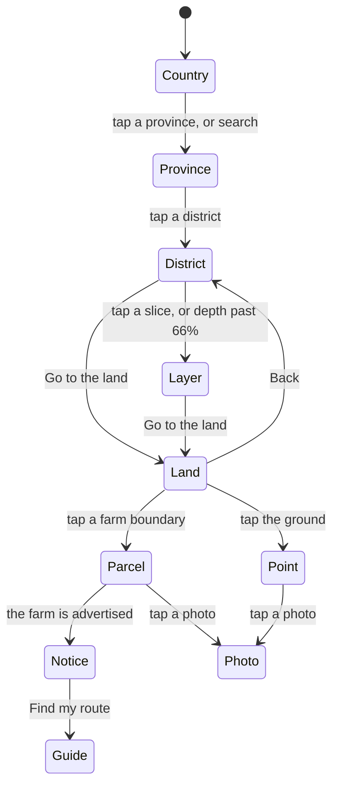
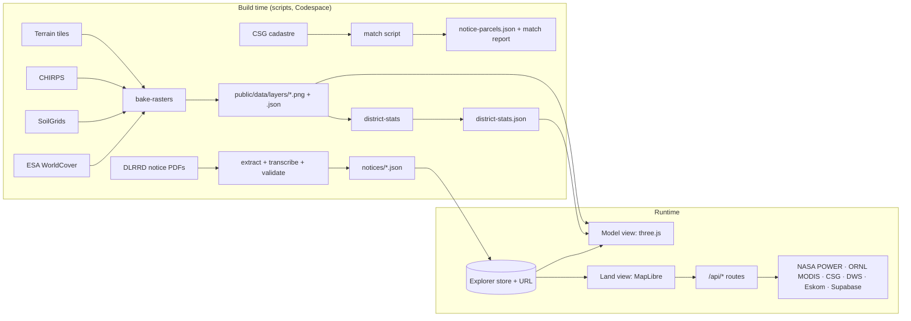

# Asbonge Land Locator: the 10x plan

Save this file in the repo as `docs/PLAN.md`. It is written to be executed one task at a time in OpenCode with DeepSeek V4.1 Flash. Every file path, line count and behaviour below was checked against the repo at commit `beb2245` (10 Sep 2026) and against the live site at land-six-blue.vercel.app.

---

## 0. The short version

The inspiration, [Human Atlas](https://human-atlas-seven.vercel.app), works because the object is the interface: one model, one "explode" slider from *Assembled* to *Every piece*, tap anything for a calm card with one next step, systems with counts, and the source named up front. Asbonge already has the bones of this (the exploded map, peelable layers, real terrain). What it lacks is a single journey, information inside the pieces, and a way for people to add what they see.

**10x here means three things:**

1. **One journey, not three map modes.** Open the whole country like an anatomy model, pull it apart into provinces, districts and data layers with one slider, then drop into real 3D terrain at the same angle, down to one farm parcel and the photos people took there.
2. **Every piece carries sourced facts.** The four layer slices stop being flat colours. They show measured land cover, soil, rainfall and government land, each with a legend, a resolution, a date and at least three numbers.
3. **People add what they see.** Signed-in users attach moderated field photos to farms and points, so an applicant can see the sheds, water and fencing before they spend money travelling there.

Where it goes past the Human Atlas: the atlas stops at the model. Asbonge continues to the real land, to a specific farm, to an action (apply, call the officer, find my route), and to ground photos. It stays honest about what the data can't tell you, and it has to work on a mid-range Android on a weak signal.

### Scorecard

| Measure | Today (`beb2245`) | Target |
|---|---|---|
| Map modes | 3 separate: Exploded map, 3D terrain, Compare area | 2 views of one journey: Model and Land |
| Floating controls over the map, 390 px phone | More than a dozen in 3D terrain | 5 or fewer |
| Phone screen used before the model starts | About 40% (header, headline, tabs, captions) | One 64 px top bar |
| Information on a layer slice | Colour only | 3+ sourced numbers, a legend and a mini chart |
| Government notices | 22, in 4 provinces | Every usable notice in the 2026 index (53 PDFs reviewed, 31 not yet in the app), re-checked weekly |
| Farms with mapped boundaries | 2 | Every exact cadastral match, and any farm in SA clickable through the CSG cadastre |
| Shareable state | Province only (`?province=`) | Every selection, view and layer set, with preview cards for WhatsApp |
| Photos | None | Moderated field photos on farms, points and the map |
| Automated checks | Typecheck + 28 unit tests | Adds lint, e2e smoke, overlap checks, screenshots, and tests for depth, URLs, camera hand-off and uploads |

---

## 1. How to run this plan in OpenCode

1. Open the repo in a Codespace. Task P0.1 makes a fresh Codespace ready in one step.
2. Save this file as `docs/PLAN.md`. Copy Appendix A into `AGENTS.md` at the repo root. Copy the four files in Appendix B into `.opencode/commands/`.
3. In OpenCode, choose DeepSeek V4.1 Flash with `/models` (through the DeepSeek or OpenRouter provider).
4. Work one task at a time: `/task P0.1`, read the diff, then `/ship`. Start a new session for each phase so old context doesn't leak into new work.
5. Tasks tagged **deep** involve maths, security or a big refactor. Use the highest reasoning level your provider offers for them and read the diff line by line.
6. Tasks tagged **you** need a person: an account, a key, a licence decision. The agent stops and asks.

**Why the plan is shaped this way.** V4.1 Flash is cheap and fast, has a 1M-token context, and reads images. It was released on 10 Sep 2026, so expect rough edges. Small tasks with a named check keep a fast model honest, and screenshots let it see what it built.

**Rules of the loop**

- A task isn't done until its **Check** passes. "It should work" is not a check.
- If the same check fails three times, stop editing code. Add a test or logging that isolates the failure, or split the task.
- One task, one diff, one commit. Don't start the next task inside the current one.
- If a task seems to need invented data to look finished, stop. Empty states are part of the design.

**If time is short, build these first:** P0 (all), P1.3–P1.6, P2.2–P2.5, P3.1–P3.7, P4.1–P4.4, P5.1–P5.7. Everything else is valuable but can wait.

---

## 2. Where the app is today

### Keep: the app's best instincts

- **No invented data.** No sample listings, nulls stay null, every figure has a source and date (`src/lib/source.ts`, `src/content/*`).
- **Honest captions.** Relief exaggeration is stated, statistical heights are labelled as not elevation, notices say a future deadline doesn't confirm availability.
- **Generative UI done properly.** A typed block vocabulary and a component registry (`src/lib/blocks.ts`, `src/lib/pathfinder.ts`, `src/components/blocks/BlockView.tsx`).
- **Performance care.** Render-on-demand loops, wall-clock tweens, a lazily loaded DEM, save-data economy mode, bounded payloads from external services (`src/app/api/infrastructure/route.ts`).
- **Real integrations.** NASA POWER climate, DWS rivers and dams, Eskom transmission lines, NGI aerial imagery, CSG cadastre, Terrarium terrain, EOX Sentinel-2.

### Fix: what holds the experience back

| # | Problem | Evidence |
|---|---|---|
| 1 | Three map modes, each with its own controls and mental model | `mapView: "anatomy" \| "atlas" \| "data"` in `src/components/LandLocator.tsx` |
| 2 | Chrome crowds the land. On a phone the 3D terrain view stacks a metric switch, a view switch, three workspace buttons, a place chip, an inspect toggle, six nav buttons, a selection chip, a status line, two layer buttons and attribution text over one map | Live site at 390 px |
| 3 | On a phone, tapping a district opens a full-width panel that hides the model, so the layer peel happens out of sight | Live site: tap Vhembe |
| 4 | Labels overlap each other and the slabs | Live site: Vhembe, Capricorn and Mopani labels stack |
| 5 | The most striking visual carries the least information: layer slices are flat colours | `LAND_LAYERS` in `src/lib/exploded-map.ts` |
| 6 | Satellite imagery has no place names or roads, so people can't orient themselves | `AtlasMap.tsx` style: satellite, relief and DEM sources only |
| 7 | Only the province is in the URL | URL effect in `LandLocator.tsx` |
| 8 | Two token sets, hard-coded hex colours in three.js and MapLibre, and a 3,308-line stylesheet with seven breakpoints appended over time | `src/app/globals.css` (`.terrain-experience` redefines the tokens), colours inline in `ExplodedMap.tsx` and `AtlasMap.tsx` |
| 9 | Unicode glyphs as icons (⌕ ⌖ ↶ ↷ ⛶ ☾) render differently across Android fonts | Throughout the components |
| 10 | Information gaps: 22 notices in 4 provinces, 2 mapped parcels, a soil panel that says SoilGrids returned nothing, no land cover or vegetation, and an SG code checker that can't look anything up | `src/content/farm-notices.ts`, `src/content/notice-coverage.json`, `src/components/LandDossier.tsx`, `src/components/SgCode.tsx` |
| 11 | Files too big for safe agent edits: `LandScene.tsx` 1,153 lines, `ExplodedMap.tsx` 1,084, `AtlasMap.tsx` 1,008 (14 `useState`), `LandLocator.tsx` 807 (14 `useState`) | `wc -l` |
| 12 | Small bugs: "1 reviewed adverts" (`GovernmentNotices.tsx` line 34); the `animate-fade-up` class used by the lightbox doesn't exist; `ProvinceDossier.tsx` and `src/lib/provinces.ts` are unused; `images.remotePatterns` allows every host although `next/image` isn't used; the revalidate webhook accepts its secret in the query string, where it ends up in logs; `npm run lint` runs `next lint` with no ESLint config or dependency | File references given |

### What the Human Atlas does well, and the land version of each

| Human Atlas | Asbonge version |
|---|---|
| The model fills the screen; UI sits at the edges | Full-bleed stage. One top bar, one camera pill, one bottom dock |
| One slider: *Assembled* to *Every piece*, with a % readout | One depth slider: *Country* → *Provinces* → *Districts* → *Every layer* (9 provinces, 52 districts, 208 layer pieces) |
| Tap → card: system chip, name, description, reference ID, one primary action ("Isolate structure") | Tap → card: layer chip, place, plain-language summary, 2–4 sourced numbers, one primary action ("Isolate", "Go to the land", "Open farm", "Add photo") |
| Systems panel with counts, "show only" and switches | Layers panel with counts ("Government land · 22 notices"), "show only", switches, and the same panel in Land view |
| Search returns concepts with piece counts | Search returns places, farms, rivers, SG codes and coordinates with counts |
| Camera presets: ¾, front, side, back | ¾, Top, Side (cross-section feel), Rotate |
| Source line under the title ("2,234 modeled pieces · BodyParts3D") | Scale and freshness under the title ("9 provinces · 52 districts · notices checked 9 Sep 2026") |
| Isolate mode blanks the reference fields (a small bug) | Every state keeps its information. The card never goes blank |

---

## 3. The target experience

### The journey



1. **Arrive.** The assembled country sits on a soft shadow, lit like an object. Nine province names. Under the title: "9 provinces · 52 districts · 4 layers". One hint above the dock: "Drag to open the land."
2. **Open it.** Drag the depth slider. Provinces drift apart, then districts, then each district's four layers lift like pages: land cover, soil, water and climate, government land. At 100%, all 208 pieces float with real data draped on them.
3. **Tap a piece.** A card rises from the bottom (right side on desktop). The camera frames the piece above the card. The card says what the layer shows here, in plain words, with numbers, a legend and the source.
4. **Isolate.** Only that district remains, its layers fanned out with leader-line labels. Swipe between layers.
5. **Go to the land.** The model fades as the camera flies into real satellite terrain at the same angle. Towns, roads, rivers, farm boundaries and photo pins appear.
6. **Tap a farm.** The card shows its SG code, farm name and portion, mapped area, any government notice (deadline countdown, officer, official PDF), a site report (slope, soil, rain, greenness, distances) and ground photos, with "Add photo", "Find my route" and "Share".
7. **Act.** "Find my route" opens the guide with the province and category preselected. "Share" sends a link that reopens exactly this view, with a preview card in WhatsApp.

### Information architecture

| Route | What it is |
|---|---|
| `/` | The explorer: Model and Land views, full screen |
| `/farm/[id]` | A notice farm as a page: server-rendered, shareable, printable, with a generated preview image |
| `/guide` | The reference that currently sits under the map in six tabs: your route, applying, money, history, what goes wrong, offices |
| `/privacy` | What photos and accounts store, why, for how long, and how to delete them |
| `/admin/photos` | Moderation queue (moderators only) |

### Architecture



Two rules fall out of this. Heavy global data (land cover, soil, rainfall) is baked once at build time into small PNG grids, the same way `scripts/build-dem.mjs` already bakes elevation, so the app never depends on a slow third-party API for it. Point-specific or fresh data (climate at a point, vegetation history, parcels, photos) goes through an API route with validation, a timeout, a bounded payload and cache headers, following `src/app/api/infrastructure/route.ts`.

---

## 4. The roadmap

Task format: **ID · title · size · tags**. Size is diff size, not hours: **S** is one or two files, **M** is two to six files, **L** is a new module or a large refactor.

### Phase 0: Build the loop

Goal: every later task can be checked in seconds, and a fresh Codespace works with no manual steps.
Exit demo: open a new Codespace, run `npm run dev`, then `/ship` goes green.

#### P0.1 · Devcontainer · S
- **Files:** `.devcontainer/devcontainer.json` (new).
- **Do:** Node 22 devcontainer image. `postCreateCommand`: `sudo apt-get update && sudo apt-get install -y gdal-bin poppler-utils && npm ci && npx playwright install --with-deps chromium`. Forward port 3000. Nothing else.
- **Check:** in a rebuilt container: `node -v` (22.x), `gdalinfo --version`, `pdftotext -v`, `npx playwright --version`.
- **Done when:** `npm run dev` works in a fresh Codespace without extra steps.

#### P0.2 · Baseline report · S
- **Do:** run `npm ci`, `npm run typecheck`, `npm test`, `npm run build`. Write `docs/baseline.md` with pass or fail for each, the build's route and first-load JS table, and build time. Fix nothing. If typecheck or build fails, stop and report.
- **Done when:** `docs/baseline.md` exists. Later tasks compare bundle size against it.

#### P0.3 · Test runner for many files · S
- **Files:** `scripts/test.mjs`, `tests/format.test.ts` (new).
- **Do:** keep node:test and esbuild. Bundle `scripts/test-explorer.tsx` plus every `tests/**/*.test.ts` and `tests/**/*.test.tsx` (recursive `fs.readdirSync`), each to its own `.cjs`, then run them all with `node --test`. Add one test for `group()` from `src/lib/format.ts`.
- **Check:** `npm test` reports 29 passing tests.

#### P0.4 · Playwright smoke, overlap check and screenshots · M
- **Files:** `playwright.config.ts`, `e2e/smoke.spec.ts`, `e2e/shots.spec.ts`, `e2e/helpers/overlap.ts` (all new); `package.json` scripts `e2e` and `shots`; `.gitignore` adds `test-results/` and `playwright-report/`.
- **Do:**
  - `webServer`: `npm run dev -- -p 3100`, `reuseExistingServer: true`, timeout 120 s.
  - Chromium launch args for WebGL without a GPU: `--use-angle=swiftshader`, `--enable-unsafe-swiftshader`.
  - Smoke: `/` loads, the `h1` is visible, a `canvas` or the "3D rendering is unavailable" fallback appears within 20 s, and choosing Limpopo updates the URL.
  - `overlap.ts`: `expectNoOverlap(page, selector)` collects bounding boxes of visible matches and fails, naming both elements, if any two intersect by more than 2 px.
  - Shots: `/` at 390×844 and 1440×900, light and dark, after the first frame. Save to `test-results/shots/<name>.png`.
- **Check:** `npm run e2e` passes; `npm run shots` writes four PNGs.

#### P0.5 · Quick fixes · S
- **Do:**
  - Add `plural(n, one, many?)` to `src/lib/format.ts` and use it for "reviewed adverts" in `GovernmentNotices.tsx`.
  - Define a `fade-up` keyframe and animation in `tailwind.config.ts` (the lightbox in `ImageCarousel.tsx` already uses `animate-fade-up`).
  - Delete `src/components/ProvinceDossier.tsx` and `src/lib/provinces.ts` (unused).
  - Remove the unused `images` block from `next.config.mjs`.
  - In `src/app/api/revalidate/route.ts`, read the secret from the `x-webhook-secret` header only. Update the README example.
- **Check:** `npm run typecheck && npm test`; the NC notices test still finds "15 reviewed adverts". Add a test that one notice renders "1 reviewed advert".

#### P0.6 · ESLint with React hooks rules · M
- **Do:** add ESLint's flat config the way `create-next-app` does for Next 15 (`eslint`, `eslint-config-next`, `@eslint/eslintrc` with `FlatCompat` extending `next/core-web-vitals`). Script: `"lint": "eslint src"`. Fix errors only; leave warnings for later.
- **Why:** a fast model most often breaks hooks dependencies. This catches that in seconds.
- **Check:** `npm run lint` exits 0.

---

### Phase 1: Foundations

Goal: make the code safe for a fast model to change, and put the pieces of the new experience in place without changing what users see (except the fixes above).
Exit demo: the site looks the same, every selection is in the URL, `/guide` exists, and the big files are smaller.

#### P1.1 · Split the stylesheet · M
- **Files:** `src/app/globals.css`, new `src/styles/*.css`, `src/app/layout.tsx`.
- **Do:** lines 1–192 of `globals.css` contain the Tailwind directives and `@layer` blocks, so they stay. Move the rest into files by the existing section comments, keeping order: `explorer.css` (from line 193), `terrain.css` (from 1068), `terrain-phone.css` (from 1595), `dossier.css` (from 1742), `anatomy.css` (from 2231), `panels.css` (from 2715), `provenance.css` (from 3270). Import them in `layout.tsx` straight after `globals.css`, in that order. No other change.
- **Check:** `npm run shots` before and after look identical. Add a Playwright visual comparison with a small pixel tolerance to prove it.

#### P1.2 · One token system · M
- **Files:** new `src/styles/tokens.css`, new `src/lib/tokens.ts`, `globals.css`, `ExplodedMap.tsx`, `AtlasMap.tsx`.
- **Do:** move the `:root` and `.dark` tokens into `tokens.css`. Remove the `.terrain-experience` token overrides so one set applies everywhere (values in section 5). `tokens.ts` exports `readToken(name)`, which returns `rgb(r g b)` from the computed style, and `onThemeChange(callback)`, which watches the `dark` class with a `MutationObserver`. Replace UI colours hard-coded in three.js and MapLibre (hover, selection, borders, labels) with `readToken`. Data colours move to `src/design/ramps.ts`.
- **Check:** a unit test for token parsing. `grep -rE "#[0-9a-fA-F]{6}" src/components` shows only references to `ramps.ts`. Screenshots in light and dark look consistent.

#### P1.3 · Explorer store and shareable URLs · L · deep
- **Files:** new `src/state/explorer.ts`, `src/state/url.ts`, `tests/url.test.ts`; edit `LandLocator.tsx`.
- **Do:** add `zustand`. Model selection as a discriminated union, the explorer's state machine:

  ```ts
  export type Selection =
    | { kind: "country" }
    | { kind: "province"; province: ProvinceCode }
    | { kind: "district"; province: ProvinceCode; district: string }
    | { kind: "layer"; province: ProvinceCode; district: string; layer: LandLayer }
    | { kind: "notice"; id: string }
    | { kind: "parcel"; sgCode: string }
    | { kind: "point"; lng: number; lat: number }
    | { kind: "photo"; id: string };
  ```

  Store fields: `view: "model" | "land"`, `selection`, `depth` (0–1), `lens`, `layers` (set of layer ids), `sheet: "none" | "inspect" | "layers" | "search" | "about" | "add-photo"`, `sheetSnap: "peek" | "half" | "full"`. Actions: `select`, `back` (one level out, the same thing Escape does), `setDepth`, `setView`, `toggleLayer`, `openSheet`, `closeSheet`.

  URL grammar, written with `history.replaceState`, debounced 200 ms:
  - `?at=province:LP`, `?at=district:LP:vhembe-district`, `?at=layer:LP:vhembe-district:soil`, `?at=notice:cornucopia`, `?at=parcel:<21-char code>`, `?at=point:30.35210,-23.83910`, `?at=photo:<uuid>`
  - `&view=land`, `&depth=0.72`, `&cam=lng,lat,zoom,bearing,pitch` (Land only), `&layers=landcover,rain,photos`
  - Old links keep working: `?province=LP` becomes a province selection.

  Move `LandLocator.tsx` onto the store. Behaviour must not change.
- **Check:** `tests/url.test.ts` round-trips every selection kind and rejects bad input (unknown province, coordinates outside SA, a code that isn't 21 characters). Smoke passes. `LandLocator.tsx` has no more than 3 `useState`.

#### P1.4 · UI primitives · M
- **Files:** new `src/components/ui/` with `Sheet`, `IconButton`, `Chip`, `Stat`, `SourceNote`, `Legend`, `Segmented`, `Slider`, `Switch`; a dev-only page `src/app/dev/ui/page.tsx` that calls `notFound()` in production.
- **Do:** add `lucide-react` for icons and Radix primitives for Slider, Switch, Toggle Group and Dialog (the unified `radix-ui` package or the individual `@radix-ui/react-*` packages). Why: accessible keyboard and focus behaviour for free, instead of a fast model hand-writing it. Style everything with the tokens; no Radix default styles.
  - `Sheet`: on phones a bottom sheet with three snaps (peek about 30% of the height, half 55%, full 92%), a drag handle, Escape to close, and focus returned to the opener. It traps focus only at full. At peek and half the stage stays interactive. On screens 1024 px and wider it renders as a right-hand panel 400 px wide.
  - `Stat`: big number with unit, label and an attached `SourceNote` (source, resolution, date). A null value renders "Not recorded".
- **Check:** Playwright tabs to the slider and changes it with the arrow keys; the sheet closes with Escape and focus returns. Screenshot of `/dev/ui` in light and dark.

#### P1.5 · Map layer registry · L
- **Files:** new `src/map/layers/` (`types.ts`, `base.ts`, `boundaries.ts`, `water.ts`, `infrastructure.ts`, `notices.ts`, `index.ts`), new `src/map/useMapLayers.ts`; edit `AtlasMap.tsx`, `InfrastructureOverlay.tsx`.
- **Do:** define

  ```ts
  export interface LayerDef {
    id: string;
    group: "base" | "land" | "soil" | "water" | "climate" | "infrastructure" | "government" | "people";
    label: string;
    description: string;               // one plain sentence
    sources: Record<string, SourceSpecification>;
    layers: LayerSpecification[];      // ids prefixed with the def id
    beforeId?: string;
    minzoom?: number;
    legend?: LegendSpec;
    attribution: { text: string; url: string; licence: string; date: string };
    defaultOn: boolean;
  }
  ```

  Move every inline `addSource` and `addLayer` from `AtlasMap.tsx` (satellite, relief, elevation, provinces, districts, rivers, notice parcels, aerial, local infrastructure) into registry entries. `useMapLayers(map, enabledIds)` adds, removes and toggles them in order. No component calls `addLayer` directly after this.
- **Check:** every current layer still renders (screenshots); `AtlasMap.tsx` is under 500 lines; a unit test checks registry ids are unique and every def has attribution.

#### P1.6 · Move the reference to `/guide` · M
- **Files:** new `src/app/guide/page.tsx`; edit `LandLocator.tsx`; new `src/app/sitemap.ts`.
- **Do:** move the six tab panels (route, applying, money, history, reality, offices) into `/guide` as anchored sections (`#route`, `#applying`, `#money`, `#history`, `#reality`, `#offices`) with a sticky in-page nav. `Pathfinder` reads `?province=` and `?category=`. The "Find my route" button links to `/guide#route` and carries the selected province. `/` keeps only the explorer.
- **Check:** `/guide#money` shows the finance section; smoke updated; the tab and panel code is gone from `LandLocator.tsx`.

---

### Phase 2: Data you can see

Goal: real, sourced information for every piece of the model, and every notice in the 2026 index in the app. These are scripts and JSON, easy to verify, and they can run in parallel with Phase 1.
Exit demo: `npm run data:rasters && npm run data:stats && npm run notices:check` all succeed. The match report lists every notice. Notices appear in more provinces.

#### P2.1 · Sources register · S
- **Files:** new `docs/data/sources.md`.
- **Do:** start from the table in section 7. Every dataset the app shows gets a row: provider, licence, resolution, date, URL, where it's used. The About sheet (P3.1) reads the same facts from `src/content/sources.ts`.

#### P2.2 · Raster bake pipeline · L
- **Files:** new `scripts/data/bake-rasters.mjs`, `scripts/data/sources.json`, `src/lib/raster.ts` (a generalised version of the decoder in `src/lib/dem.ts`), `tests/raster.test.ts`; outputs in `public/data/layers/`.
- **Do:** use GDAL through `child_process`. Grid: EPSG:4326 with the same box as `public/data/sa-dem.json` (west 16.35, south −35, east 33.05, north −22), 1024 × 797 cells, each under 2 km across. For each layer write two files:
  - `<layer>.values.png` plus `<layer>.json` holding the numbers, using the DEM's two-byte encoding (value = (R × 256 + G) × step − offset) for continuous data, or a class code for categories. The JSON records bounds, size, step, offset, nodata, units, legend, source, licence and date.
  - `<layer>.color.png`: the same grid already coloured with the ramp from `src/design/ramps.ts`, exported to JSON for the script. Displaying it needs no shader.

  | Layer id | Source | Method |
  |---|---|---|
  | `landcover` | ESA WorldCover 2021 v200, public COGs (bucket `esa-worldcover`, eu-central-1, CC BY 4.0) | List the 2021 map tiles, keep those overlapping the box, build a VRT, `gdalwarp -r mode` |
  | `rain` | CHIRPS annual totals 1991–2020 (public domain) | Average the 30 annual rasters, `gdalwarp -r average` |
  | `soil-ph`, `soil-clay` | SoilGrids 2.0 (CC BY 4.0) at `files.isric.org/soilgrids/latest/data/` | Depth-weighted 0–30 cm mean from 0–5, 5–15 and 15–30 cm (weights 5, 10, 15), read through `/vsicurl/` VRTs, reprojected to EPSG:4326 |
  | `hillshade` | The existing DEM | `gdaldem hillshade` |

  Spike first: list the real file names (`aws s3 ls --no-sign-request`, or the HTTPS directory listings) and write them into `sources.json`. Don't guess paths.
- **Check:** `node scripts/data/bake-rasters.mjs --only rain` writes both PNGs and the JSON. `tests/raster.test.ts` decodes each layer with `pngjs` and checks relationships rather than exact values: rain at Upington (−28.45, 21.25) is below 350 mm and below Pietermaritzburg (−29.6, 30.38); land cover at central Johannesburg (−26.204, 28.047) is built-up; topsoil pH at Upington is higher than at Pietermaritzburg. Each file is under 600 KB.

#### P2.3 · District statistics · M
- **Files:** new `scripts/data/district-stats.mjs`, `src/data/district-stats.json`, `tests/district-stats.test.ts`.
- **Do:** for each of the 52 districts in `src/data/sa-districts.topo.json`, find grid cells whose centres fall inside it (`geoContains` from `d3-geo`), and compute: area in km², rain mean with 10th and 90th percentiles across cells, land-cover shares by class, soil pH and clay means, elevation mean, minimum and maximum, plus counts of notices and mapped parcels. Record the source block for each statistic.
- **Check:** 52 districts present; land-cover shares sum to between 0.98 and 1.02; no NaN (nulls only where a raster has no data); values within physical ranges (pH 3–10, clay 0–100%, rain 0–3,000 mm).

#### P2.4 · Notices pipeline · L · deep
Split into five tasks so each one is checkable.
- **P2.4a · Fetch.** `scripts/notices/fetch.mjs` reads `NOTICE_INDEX` (from `src/content/farm-notices.ts`), collects PDF links under `/images/application_to_lease_state_farms/2026/`, downloads them to `scripts/.cache-notices/pdf/` (gitignored) and writes `index.json` with file, url, bytes and sha256. `--list-only` skips downloads.
- **P2.4b · Extract.** `scripts/notices/extract.mjs` runs `pdftotext -layout` into `.txt` files and flags any PDF with under 200 characters of text as "needs OCR" for a person.
- **P2.4c · Schema and move.** `src/content/notices/schema.ts` defines the notice with `zod`: the current `FarmNotice` fields plus `status: "advert" | "amended" | "withdrawn"`, `supersedes?`, `sgCodes?`, `lpids?`, `registrationDivision?`, `farmNumber?`, `portions?`, `checkedAt`. Move the 22 existing notices into one JSON array per province (`src/content/notices/LP.json` and so on) with a static `index.ts` that imports all nine. `FARM_NOTICES` keeps its export name so callers don't change.
- **P2.4d · Transcribe, five PDFs per task.** The 31 PDFs from the 2026 index that aren't in the app yet are listed by comparing `notice-coverage.json` with the notice files. For each, the agent reads the `.txt` and writes a record. Hard rules: anything the PDF doesn't state is `null`; `facts` are short paraphrases, never pasted paragraphs; contact names and numbers exactly as printed; withdrawals and amended re-adverts are recorded with `status` and `supersedes`.
- **P2.4e · Validate.** `npm run notices:check` runs the schema plus cross-field rules: deadline is ISO with `+02:00`; phone has 10 digits starting with 0; hectares above 0 and below 100,000; the file exists in `index.json`; ids are unique; an amended notice supersedes an existing id. Update the scope sentence in `notice-coverage.json`.
- **Check:** `npm run notices:check` passes; existing tests still pass (the NC test still finds 15); the Layers panel count matches the data.

#### P2.5 · Cadastral matching · L · deep
- **Files:** new `scripts/notices/match-cadastre.mjs`, `docs/data/match-report.md`; updates `src/data/notice-parcels.json`.
- **Do:** spike first. `curl` the CSG layer (`CADASTRE_SOURCE` in `src/lib/cadastre.ts`) with `?f=json` to read field names, `maxRecordCount` and `supportedQueryFormats`, then run one attribute query. The fields used in `src/data/nc-district-evidence.json` (`ID`, `FARMNAME`, `PARCEL_NO`, `PORTION`, `MAJ_REGION`, `GEOM_AREA`) are the starting point. For each notice, query candidates by farm name (upper case, no "FARM", no apostrophes), parcel number, portion and region, then compare the mapped area (`GEOM_AREA` in m² ÷ 10,000) with the notice's hectares:
  - **exact:** SG code match, or area within 5%;
  - **probable:** area within 25%;
  - **none.**

  Only exact matches are written to `notice-parcels.json`, with geometry simplified to at most 200 vertices, in the existing shape (`noticeId`, `cadastralId`, `name`, `gisHectares`, `coordinates`, `checkedAt`, `sourceDate`). Probable matches appear only in the report, never as boundaries.
- **Check:** California 27 and Hartebeestpoort 717 still match; the report lists every notice with its candidates, decision and reason.

#### P2.6 · Weekly freshness watch · S
- **Files:** new `.github/workflows/notice-watch.yml`.
- **Do:** trigger on `schedule` (weekly) and `workflow_dispatch` only. Run `node scripts/notices/fetch.mjs --list-only`, compare with `notice-coverage.json`, and if new PDFs appear, open an issue listing them (`gh issue create` with the workflow token and `issues: write` permission). It never transcribes on its own.
- **Check:** a manual `workflow_dispatch` run completes.

---

### Phase 3: The anatomy of the land

Goal: the hero experience. One stage, one depth slider, pieces that carry data, a calm inspect card, a layers panel, search and camera presets.
Exit demo: on a phone, drag from 0% to 100%, tap a district, read real numbers, isolate a layer, search "poultry", and share the link.

#### P3.1 · Explorer shell · L
- **Files:** new `src/components/explorer/` (`ExplorerShell`, `TopBar`, `CameraPill`, `Dock`, `DepthSlider`, `ViewSwitch`, `AboutSheet`), new `src/styles/shell.css`; edit `LandLocator.tsx`.
- **Do:** build the layout in section 5 exactly. Remove the metric switch, the three-way view switch, the focus and collapse buttons, the mobile dock, the notice browser aside and the relief caption. Captions and credits move into the About sheet, which lists every source from `src/content/sources.ts`. The subline shows counts computed from data, never typed by hand. Floating controls over the stage get `data-overlay`; the top bar, dock and sheet get `data-chrome`.
- **Check:** `expectNoOverlap(page, "[data-overlay], [data-chrome]")` passes at 390×844 and 1440×900; no more than 5 visible `[data-overlay]` controls on a phone; screenshots match section 5.

#### P3.2 · Depth as a pure function · M · deep
- **Files:** new `src/scene/depth.ts`, `tests/depth.test.ts`.
- **Do:** `pieceTransforms({ depth, selection, provinces, districts })` returns, for each piece id, `{ offsetX, offsetZ, lift, layerGap, ghost }`.
  - Stage A (0 to 0.33): provinces move out from the national centre.
  - Stage B (0.33 to 0.66): districts move out from their province centre, only in the selected province if one is selected, otherwise everywhere.
  - Stage C (0.66 to 1): layers separate vertically, for the selected district or for every visible district ("Every layer").
  - Inside each stage use smoothstep. Reuse `explosionOffset` and `sliceHeight` from `src/lib/exploded-map.ts`.
- **Check:** at 0 every offset is zero; at 0.33 provinces are fully apart and districts are at zero; at 1 layer gaps are at maximum; offsets never decrease as depth rises (sampled every 0.05); with a district selected, other provinces are marked `ghost` and don't move in stage B.

#### P3.3 · One scene module · L · deep
- **Files:** new `src/scene/` (`core.ts`, `pieces.ts`, `picking.ts`, `camera.ts`), new `src/components/explorer/ModelView.tsx`; delete `ExplodedMap.tsx` once at parity.
- **Do:** extract renderer, camera, controls, lights, the render-on-demand loop and the wall-clock tweens from `ExplodedMap.tsx` into `core.ts` without changing behaviour. `pieces.ts` builds provinces and all 52 districts with four layer meshes each (the existing `makePiece` already does this) plus relief (`applyRelief`). `ModelView` subscribes to the store and applies `pieceTransforms` every frame while tweening. Port the tests that import `makePiece` and render `ExplodedMap`; keep their intent (keyboard selectors, layer controls and a data-scope statement exist) and change strings on purpose, never by deleting assertions.
- **Check:** smoke passes; the depth slider at 100% shows layer pieces for every district; the scene chunk is no more than 10% larger than in `docs/baseline.md`.

#### P3.4 · Label placement · M
- **Files:** new `src/scene/labels.ts`, `tests/labels.test.ts`.
- **Do:** `placeLabels(candidates, viewport)` sorts by priority (selected, hovered, larger area, others), places each label if its box doesn't intersect one already placed, and caps visible labels at 10 on phones and 20 on desktop. Anything left over becomes a small dot. Keep the SVG leader lines for layer labels.
- **Check:** unit tests prove no two visible boxes overlap, the selected label always shows, and the output is deterministic. `expectNoOverlap(page, ".anatomy-label")` passes at depth 0, 0.5 and 1 on a phone.

#### P3.5 · Data on the slices · L
- **Files:** `src/scene/pieces.ts`, new `src/scene/textures.ts`, `tests/uv.test.ts`.
- **Do:** give each layer slab the matching `<layer>.color.png` from P2.2: land to `landcover`, soil to `soil-ph` (with `soil-clay` in the card), climate to `rain` with rivers draped on top, and government land to a neutral slab with notice and parcel markers. Compute UVs by calling the existing `worldToLonLat` in `src/lib/dem.ts` (don't re-derive the projection). `ExtrudeGeometry` creates two material groups (caps, then side walls), so pass `[capMaterial, sideMaterial]`: texture on the caps, a plain darker tone on the sides. Load textures only when depth passes 0.6 or a layer is inspected. Categorical textures use `NearestFilter`.
- **Also:** the footnote changes from "thematic slices, not measured soil strata" to "Slices show measured estimates on a grid under 2 km. Their thickness is not soil depth."
- **Check:** UV corners map to 0 and 1; a depth-1 screenshot shows four distinct textured layers; no console WebGL errors.

#### P3.6 · Inspect cards · L
- **Files:** new `src/components/explorer/inspect/` with one card per selection kind (`Province`, `District`, `Layer`, `Notice`, `Parcel`, `Point`, `Photo`) and a registry keyed by `selection.kind`, the same pattern as `BlockView.tsx`.
- **Do:** each card has, top to bottom: a chip (layer colour and name), a title in plain words, one summary sentence, two to four `Stat`s with `SourceNote`, a mini chart where it helps (land-cover stacked bar, rain range bar, notice deadline countdown), one primary action, secondary actions (Find my route, Share), and a "What this doesn't tell you" line. Numbers come from `district-stats.json`, `provinces.ts` and the notices. Feed listings from `LAND_DATA_URL` keep appearing in province and district cards when a feed is connected.
- **Check:** render tests (`renderToStaticMarkup`, like the existing ones) for every card: the source text is present, the output never contains "undefined" or "NaN", and null values show "Not recorded".

#### P3.7 · Layers panel and outline view · M
- **Do:** presets (All, Land and soil, Water, Government land, Field photos); one row per layer with colour dot, name, count, a "show only" tap target and a switch; footer "N pieces visible · Hide all". A "Height shows" select for lenses (P3.10). An "Outline" tab shows the same hierarchy as nested lists of buttons (country, provinces, districts, layers) so the model can be used without 3D or a mouse.
- **Check:** switching a layer off hides its pieces (a test on store state plus an e2e count); counts equal the data.

#### P3.8 · Search · M
- **Files:** new `src/lib/search.ts`, `tests/search.test.ts`, `src/components/explorer/SearchSheet.tsx`.
- **Do:** a local index of provinces, districts, notices (name, district, enterprise), river names (from `sa-rivers.json`), plus pattern detection for 21-character SG codes and for coordinates (`-23.84, 30.35`). Score exact prefix above word prefix above substring, with no dependency. Pressing `/` opens search; arrow keys and Enter work. Each result shows its type and a count ("Mopani District · 1 notice").
- **Check:** "vhembe" returns the district first; "poultry" returns the poultry notices; "-23.84, 30.35" returns a point; a 21-character code returns an SG lookup.

#### P3.9 · Camera presets and isolate · M
- **Do:** presets ¾, Top and Side; Rotate toggles auto-orbit; Reset returns depth 0, country selection and ¾. Isolate hides every other piece and fans out the chosen district; "Show surrounding land" undoes it. When the sheet is open, frame the selection in the visible area above it (`camera.setViewOffset` on phones, a left offset on desktop).
- **Check:** e2e confirms presets change a `data-camera` attribute and isolate reduces the visible piece count.

#### P3.10 · Lenses replace Compare area · M
- **Do:** the "Height shows" select offers Real relief (default), Hectares advertised (Oct 2020), Hectares released (Feb 2020), State land share, Annual rain, and 2026 notices. Province metrics scale provinces; rain and notices scale districts. Show a legend and the caption "Heights show statistics, not elevation." Then delete `LandScene.tsx`.
- **Check:** unit test for the value-to-height mapping (linear, fixed maximum); the build no longer has a LandScene chunk.

#### P3.11 · Poster, first run and failure state · S
- **Do:** `npm run poster` uses Playwright to capture the assembled model at 1200×900 in light and dark into `public/poster/`. Show the poster until the first WebGL frame. First-run hint "Drag to open the land" disappears after the first depth change (remembered in `localStorage` inside try/catch). If WebGL fails, show the poster with "3D isn't available on this device" and a button for the Outline view.
- **Check:** with WebGL disabled in Playwright, the fallback appears and the Outline view works.

---

### Phase 4: The Land view

Goal: the real map becomes a place where you can orient yourself, find any farm, measure it and read its site.
Exit demo: from a district, "Go to the land"; paste an SG code and fly to the farm; measure a field; draw a profile; load its greenness history; share the view and open it on another phone.

#### P4.1 · Hand-off from the model · M · deep
- **Files:** new `src/scene/handoff.ts`, `tests/handoff.test.ts`, `src/components/explorer/LandView.tsx`.
- **Do:** as soon as a district is selected, mount the map underneath at full size with `opacity: 0` and no pointer events so tiles start loading. On "Go to the land", read `getAzimuthalAngle()` and `getPolarAngle()` from the orbit controls, set bearing to `−azimuth` in degrees (normalised to 0–360) and pitch to the polar angle in degrees clamped to the map's max pitch, then `fitBounds` the district (`districtBounds` in `src/lib/terrain.ts`) with bottom padding equal to the sheet height. Fade the model out over 400 ms while the map flies. Pause the model's loop but keep it mounted, so Back returns instantly to the same depth and selection.
- **Check:** unit tests for the mapping, including a camera east of the target (it must face west, bearing 270) and a top-down camera (pitch 0). A before and after screenshot pair shows the same orientation.

#### P4.2 · Place names on satellite · M
- **Do:** fetch the OpenFreeMap "liberty" style JSON once in a spike and copy only its vector source and the label layers for places, main roads and water names into a registry def (`labels`, default on). Style label text with the tokens and a dark halo so it reads on imagery. Attribution comes through automatically (OpenFreeMap: no key, no request limits, attribution required).
- **Check:** screenshot at zoom 8 and 13 shows town and road names; attribution present.

#### P4.3 · Every farm clickable (CSG parcels) · L
- **Files:** new `src/app/api/cadastre/route.ts`, `src/lib/cadastre-query.ts`, `tests/cadastre.test.ts`, registry def `parcels`.
- **Do:** follow the infrastructure route exactly: validate a bbox inside SA no larger than 0.1° per side, allow it only from zoom 13, time out at 9 s, cap the payload, cache for 12 h. Ask the service for GeoJSON if `supportedQueryFormats` allows it; otherwise convert Esri JSON rings to GeoJSON in `cadastre-query.ts`. Return `{ sgCode, farmName, parcelNo, portion, region, areaHa }` per parcel. Draw thin outlines with a light halo, and labels "Farm name · portion" from zoom 14. Tapping one selects `{ kind: "parcel" }`.
- **Check:** unit tests for bbox validation and ring conversion; an e2e test with a mocked route shows the parcel card with a copyable SG code.

#### P4.4 · SG code lookup · M
- **Files:** new `src/app/api/cadastre/sg/[code]/route.ts`; edit `SgCode.tsx` and search.
- **Do:** accept only `^[A-Z0-9]{21}$` (this also blocks injection into the `where` clause), query `ID='<code>'`, and return the geometry and attributes. `SgCode.tsx` gains "Find this parcel", and its copy drops "there is no public lookup wired in". Search routes SG codes here.
- **Check:** a test rejects bad codes; an e2e test with a mocked route flies to a parcel.

#### P4.5 · Measure and draw · M
- **Do:** add `terra-draw` and `terra-draw-maplibre-gl-adapter`. The adapter supports MapLibre v4, v5 and v6 as of terra-draw 1.32 and adapter 1.4. Modes: line (distance in km) and polygon (area in hectares), using `@turf/length` and `@turf/area`. A small tool card shows the running figure, with "Clear" and "Use as photo location".
- **Check:** unit tests on known shapes (a 1 km × 1 km square in degrees at SA latitudes is close to 100 ha, within 2%).

#### P4.6 · Elevation profile · M
- **Do:** after a line is drawn, sample 128 points along it. Use `map.queryTerrainElevation` divided back to ground height with `groundElevation`; if terrain is off or tiles are missing, fall back to the baked DEM (`elevationAt` in `src/lib/dem.ts`) and say so, with its 2.3 km spacing. Chart: SVG area with min, max, total climb and steepest slope.
- **Check:** unit test for the sampling and slope maths; screenshot of the chart.

#### P4.7 · Site report for any point · L
- **Do:** the Point card's site report adds:
  - slope and aspect from a 3×3 grid of terrain samples about 30 m apart;
  - soil pH, clay and land cover from the baked grids ("regional estimate on a grid under 2 km, not a soil test");
  - more NASA POWER parameters. Spike first to confirm names through the POWER parameter listing (candidates: `T2M_MAX`, `T2M_MIN`, `ALLSKY_SFC_SW_DWN`). One climatology request can carry up to 20 parameters for a point. Show frost-risk and heat months from monthly minimum and maximum;
  - distance to the nearest mapped river, dam and transmission line from the infrastructure data, labelled "a mapped line is not a connection or a water right."

  The current SoilGrids live-lookup message goes; SoilGrids' REST API is in beta with a fair-use limit of 5 calls a minute (ISRIC), which is why soil comes from the baked grid.
- **Check:** unit tests for slope and aspect on synthetic planes (flat, 45° facing north); render tests show sources for every number.

#### P4.8 · Vegetation history on demand · M
- **Files:** new `src/app/api/ndvi/route.ts`, `src/lib/ndvi.ts`, `tests/ndvi.test.ts`.
- **Do:** a "Load 2-year greenness" button calls the route, which uses the ORNL DAAC MODIS subset service (`https://modis.ornl.gov/rst/api/v1/MOD13Q1/subset`, 250 m, 16-day). The service allows at most 10 dates per request, so the route fetches the dates list, requests in chunks of 10 (about five requests for two years), drops unreliable pixels using the product's reliability band (confirm band names through `/MOD13Q1/bands` in a spike), caches for 30 days, and returns `[{ date, ndvi }]`. Chart: line with the season shaded. Caption: "Greenness, not yield." Cite ORNL DAAC as its terms ask.
- **Check:** unit tests for chunking and parsing against a saved fixture response.

#### P4.9 · Then and now · M
- **Do:** a swipe comparison of EOX Sentinel-2 cloudless 2016 (current basemap, CC BY 4.0) and the 2024 layer (CC BY-NC-SA 4.0: fine while the site is non-commercial; if it ever earns money, license it or drop it). Take the 2024 layer id from EOX's WMTS capabilities in a spike. Two synced maps in 2D with a draggable divider and `clip-path`; terrain off in this mode.
- **Check:** e2e drags the divider; the attribution shows both years.

#### P4.10 · Declutter the Land view · M
- **Do:** on phones, allow only these floating controls: zoom in, zoom out, 2D/3D compass, locate me, attribution (i). Remove the inspect-mode toggle: a tap on the ground inspects a point, and at low zoom a tap on a district selects it. Quality, aerial close-up and relief move into the Layers panel under "Imagery". Status messages become toasts that clear after 4 s. Compact attribution never sits under the dock.
- **Check:** `expectNoOverlap(page, "[data-overlay], [data-chrome]")` and at most 5 visible `[data-overlay]` controls at 390×844.

#### P4.11 · Share and farm pages · M
- **Files:** new `src/app/farm/[id]/page.tsx`, `src/app/farm/[id]/opengraph-image.tsx`, `src/components/explorer/ShareButton.tsx`.
- **Do:** Share uses the Web Share API with copy-link as the fallback, and shares the current URL from P1.3. `/farm/[id]` server-renders the notice card, site facts and photos, with `generateStaticParams` over all notices so preview images are built at build time (which also avoids runtime image generation on the Cloudflare build). The image shows farm name, hectares, enterprise, deadline and a district silhouette drawn from the district polygon as SVG. Add a print stylesheet so people can take the page to the office or the bank.
- **Check:** `npm run build` lists the farm routes; the preview image renders for one notice; the page prints on two A4 pages or fewer.

#### P4.12 · Application timeline estimate · S
- **Do:** on notice cards with a deadline ahead, add up the stage durations in `src/content/process.ts` (they're already in approximate days) from the closing date and show a timeline with a date range for a decision, labelled "Estimate from typical committee timings. Not a promise."
- **Check:** unit test for the date arithmetic; the range is shown as a range, never a single date.

---

### Phase 5: Field photos

Goal: people who visit a farm can show what's there. Signed-in users upload; nothing appears until a moderator approves it.
Exit demo: sign in on a phone, add two photos with GPS from a farm card, approve them in `/admin/photos`, see them in the farm gallery and on the map, report one, delete your own.

The full spec is in section 6. Tasks:

#### P5.0 · Decisions and accounts · S · you
- Create a Supabase project and set `NEXT_PUBLIC_SUPABASE_URL`, `NEXT_PUBLIC_SUPABASE_PUBLISHABLE_KEY` (or the legacy anon key) and `SUPABASE_SECRET_KEY` (or the legacy service role key, server only) as Codespaces secrets and in Vercel.
- Set up custom SMTP (for example Resend) for sign-in codes; Supabase's built-in email is only suitable for testing.
- Confirm the upload policy. This plan assumes signed-in users with moderation, because it blocks spam and personal-information leaks. Choose admin-only uploads instead if you want a curated archive.
- Have the privacy notice reviewed by someone who knows POPIA before launch.
- **Why Supabase here:** photo uploads need identity, a table and object storage. Supabase gives all three with row-level security and signed uploads in one SDK, so a fast model has one integration to get right instead of three. If you'd rather stay on Neon, swap in Neon + Drizzle, Better Auth and Cloudflare R2 behind the same `PhotoStore` interface (P5.2).

#### P5.1 · Schema, policies and buckets · M · deep
- **Files:** new `supabase/migrations/0001_field_photos.sql` (section 6).
- **Check:** apply it to the project; with the publishable key a signed-in user can read approved photos and their own pending ones, and nobody else's pending photos; with no session, only approved photos. Write these as a script `scripts/photos/policy-check.mjs` using two test accounts.

#### P5.2 · PhotoStore interface · M
- **Files:** new `src/features/photos/store/` with `types.ts` (the interface), `memory.ts`, `supabase.ts`.
- **Do:** every photo route talks to `PhotoStore`, never to Supabase directly. `PHOTO_STORE=memory` powers unit and e2e tests without a network; `PHOTO_STORE=supabase` is used in production.
- **Check:** the same contract test suite runs against the memory store in `npm test`, and against Supabase manually.

#### P5.3 · Sign-in with an emailed code · M
- **Files:** new `src/lib/supabase/client.ts`, `src/lib/supabase/server.ts`, `src/middleware.ts` (session refresh, the pattern in the `@supabase/ssr` docs; it must sit in `src/` because the app uses a `src` directory), `src/components/account/SignInSheet.tsx`, `AccountMenu.tsx`.
- **Do:** email, then a 6-digit code (`signInWithOtp`, then `verifyOtp` with type `email`); the email template must include the token. Codes work better than magic links on phones because links often open in a different browser. Account menu: My photos, Delete my photos, Sign out.
- **Check:** e2e with the memory store's fake auth; manual check with a real inbox.

#### P5.4 · Upload routes and quotas · M · deep
- **Files:** new `src/app/api/photos/start/route.ts`, `complete/route.ts`, `route.ts` (list), `[id]/route.ts` (delete), `[id]/report/route.ts`; `src/features/photos/schema.ts` (zod).
- **Do:** contracts in section 6. `start` checks the session and the daily quota (default 30, from `PHOTO_DAILY_LIMIT`), then returns signed upload tokens for the image and its thumbnail. `complete` validates the body, confirms both objects exist within size limits, and inserts the row as `pending`. The secret key is only ever read on the server.
- **Check:** unit tests for validation (outside SA, bad tags, caption over 280 characters, 7 files) and quota; e2e against the memory store.

#### P5.5 · The add-photo flow · L
- **Files:** new `src/features/photos/machine.ts` (pure reducer), `tests/photo-machine.test.ts`, `src/features/photos/process.ts` (image work), `src/features/photos/AddPhotoSheet.tsx`.
- **Do:** the reducer, image processing and screens exactly as in section 6. Two buttons: "Choose photos" and "Take photo" (`capture="environment"`).
- **Check:** reducer tests (can't submit without a location or consent; six-file limit; oversized files rejected with a message); a test that the output image has no EXIF (`exifr` returns nothing); e2e end to end with the memory store.

#### P5.6 · Showing photos · L
- **Do:**
  - Farm, parcel and point cards get a Photos section: a grid with tag filters, a count, and the pending state visible only to the uploader.
  - Reuse `ImageCarousel.tsx` as the lightbox and add a details panel: date taken, tags, caption, direction, distance from the farm boundary, Report.
  - A `photos` layer def: clustered circles with counts; from zoom 14, round thumbnails with a small direction wedge (HTML markers, at most 50 on screen).
  - Model view: a photo count on district labels and a "Field photos" row in the Layers panel.
  - Placeholders use each photo's stored dominant colour; images load lazily with fixed width and height to avoid layout shift.
- **Check:** e2e with seeded memory-store photos: the cluster count is right, the lightbox opens, pending photos never show to other users.

#### P5.7 · Moderation · M · deep
- **Files:** new `src/app/admin/photos/page.tsx`, `src/app/api/admin/photos/[id]/decision/route.ts`.
- **Do:** the server checks the role before rendering. Queue: large preview, a mini map, derived details, Approve, Reject with a reason, Remove; keyboard A, R, J, K. Approving downloads the object from `photos-pending`, uploads it to `photos`, deletes the original, and records `reviewed_by` and `reviewed_at`. Downloading and re-uploading avoids relying on cross-bucket moves.
- **Check:** a non-moderator gets 404 from the page and 403 from the route; approve and reject covered by e2e against the memory store.

#### P5.8 · Reports, takedown and privacy · M
- **Do:** Report (signed in; reasons: a person is identifiable, private property, wrong place, offensive, other). Three reports send a photo back to `pending`. `/privacy` explains what is stored, why, retention, deletion and a contact. "Delete my photos" marks rows `removed` and deletes the objects.
- **Check:** e2e for report threshold and deletion.

#### P5.9 · Upload when the signal returns · M · optional
- **Do:** keep processed photos and their metadata in IndexedDB when an upload fails offline, retry on the `online` event, and show "3 photos waiting for signal". Farms often have poor coverage.
- **Check:** e2e with Playwright's offline mode.

---

### Phase 6: Reach and polish

- **P6.1 · Performance budget · S.** First-load JS for `/` no bigger than the baseline plus 15%; poster visible fast on a throttled mid-range phone profile; three.js and MapLibre stay in separate lazy chunks. Record the numbers in `docs/baseline.md`.
- **P6.2 · Accessibility pass · M.** A script checks contrast for every text and background token pair (AA, 4.5:1 for body text). Keyboard path through the whole journey. Reduced motion turns flights into cuts. Every canvas has a text alternative through the Outline view.
- **P6.3 · Guided stories · M.** JSON-defined camera paths with captions, rendered by the existing block registry pattern: "Where the 2020 hectares went", "Rivers and irrigation", "Northern Cape's 15 notices". Each step is a selection plus depth plus a short text.
- **P6.4 · Installable app · M.** Manifest and a service worker that caches the shell, posters and baked layers; the last viewed farm opens offline.
- **P6.5 · Languages · L.** Add i18n (`next-intl`) for interface strings, starting with the languages your users ask for. Ship only translations reviewed by fluent speakers; machine translation of land and legal terms is risky.
- **P6.6 · Notice alerts · L.** "Tell me when land is advertised in my province" by email, driven by the P2.6 watch. Needs sign-in from Phase 5.

---

## 5. Design spec

### The one decision

**The land is the colour.** The interface is quiet paper and ink. All colour comes from data (land cover, soil, rain, government land) plus one accent for interactive state. That keeps the model the hero, the way the Human Atlas keeps the body the hero.

### Type

| Role | Face | Use |
|---|---|---|
| Names | Source Serif 4 (Google Fonts, via `next/font`) | Title, place names, card titles, map labels (italic for water) |
| Interface | Inter (already loaded) | Controls, body text, stats with `tabular-nums` |
| Identifiers | IBM Plex Mono (already loaded) | SG codes, coordinates, LPIDs, dates in source notes |

Rule: names are serif, controls are sans, codes are mono. Swapping Manrope for Source Serif 4 is a single font variable change if you'd rather keep Manrope.

Scale (px): 12, 14, 16, 20, 24, 32. Line height 1.5 for body, 1.2 for titles. Card body text no wider than 60 characters.

### Colour tokens

Contrast ratios were computed for these pairs; all text pairs pass AA (4.5:1) on both `paper` and `surface`.

| Token | Light | Dark | Notes |
|---|---|---|---|
| `paper` | `#F4F3EE` | `#0E1513` | Stage and page ground |
| `surface` | `#FFFFFF` | `#151E1B` | Cards, dock, sheets |
| `raised` | `#FFFFFF` | `#1B2622` | Inputs, pressed states |
| `ink` | `#16201C` | `#E8EDE9` | 15:1 on paper in both themes |
| `muted` | `#56625C` | `#A3ADA7` | 5.7:1 light, 8.0:1 dark |
| `faint` | `#646E68` | `#8A948E` | 4.8:1 light, 5.9:1 dark; captions only |
| `rule` | `#E1E2DC` | `#2A3531` | Hairlines |
| `accent` | `#1A704B` | `#7FD6A4` | The current green, kept. White on accent is 6.1:1 |
| `critical` | `#A3271F` | `#E67A72` | Errors, closed deadlines |
| `warn` | `#8A5A00` | `#E0B45C` | Deadline within 7 days |

Data ramps (`src/design/ramps.ts`), never used for UI state:

- **Rain (sequential blue):** `#EEF4F7 #CFE3EC #A6CCDD #77AFCB #4B90B5 #2B6F97 #1B4F70`
- **Soil pH (diverging at 6.5):** `#B4513A #D98B5F #EBC39C #EDE6D6 #A9C5C2 #6B9CA3 #3E6F7F`
- **Clay (sequential brown):** `#F3EBDD #E2CFAE #C9AA7C #A9824F #7F5B30`
- **Land cover:** a muted version of the official WorldCover legend, same hue families so GIS users recognise it: tree cover `#3F7D4E`, shrubland `#B9A254`, grassland `#D8CF7A`, cropland `#C98FB5`, built-up `#B5534A`, bare `#CFC6B8`, water `#4E86B5`, wetland `#4FA3A0`.

### Layout: phone (390 × 844), Model view

```
┌──────────────────────────────────────┐
│ ▲ Asbonge                  ⌕  ▤  ⓘ   │  top bar, 64 px incl. subline
│   9 provinces · 52 districts · …     │
│          ┌──────────────────┐        │
│          │ ¾  Top  Side  ⟳  │        │  camera pill, 44 px
│          └──────────────────┘        │
│                                      │
│          (3D land, full bleed)       │
│                                      │
│                                      │
│  ┌────────────────────────────────┐  │
│  │ ≋   Open the land         48%  │  │  dock, 76 px, 12 px from edges
│  │     ●━━━━━━━━○──────────────   │  │  Layers · depth · Model/Land
│  │  Country Provinces Districts Layers │
│  └────────────────────────────────┘  │
└──────────────────────────────────────┘
```

Same phone with a layer inspected (sheet at peek, sitting above the dock):

```
│  ┌────────────────────────────────┐  │
│  │              ───               │  │  drag handle
│  │ ● SOIL · <district>            │  │  chip: layer colour + name
│  │ <plain-language summary>       │  │  title
│  │ pH x.x   Clay xx%   ▁▂▃▅▇      │  │  two stats + legend strip
│  │ [ Isolate this layer        → ]│  │  one primary action
│  └────────────────────────────────┘  │
```

### Layout: desktop (1440 × 900)

```
┌─────────────────────────────────────────────────────────────────────┐
│ ▲ Asbonge  9 provinces · 52 districts · …        Guide  About   ⌕   │
├──────────────┬────────────────────────────────────┬─────────────────┤
│ Layers panel │        (3D land, full bleed)       │ Inspect panel   │
│ 320 px, when │        ┌──────────────────┐        │ 400 px, when    │
│ open         │        │ ¾  Top  Side  ⟳  │        │ something is    │
│              │        │                  │        │ selected        │
│              │        └──────────────────┘        │                 │
│              │  ┌──────────────────────────────┐  │                 │
│              │  │ ≋ Open the land ●━━━○──  ◐   │  │                 │
│              │  └──────────────────────────────┘  │                 │
└──────────────┴────────────────────────────────────┴─────────────────┘
```

Panels float over the stage with 16 px margins. The stage is always full bleed, and the camera frames the selection in whatever area the panels leave.

### Components and states

- **Z-order:** stage 0, labels 10, camera pill and dock 20, panels 30, full sheet 40, dialogs and toasts 50.
- **Shape:** radius 16 for dock and cards, 12 for inner cards, 8 for inputs, pills fully round. One elevation: `0 8px 24px rgb(0 0 0 / 0.08)` plus a 1 px `rule` border.
- **Touch targets** at least 44 × 44 px.
- **Motion:** panels and sheets 220 ms ease-out (the existing `cubic-bezier(0.16, 1, 0.3, 1)`); hover lift 150 ms; camera flights 1,000 ms; the depth slider moves pieces directly with no lag. With `prefers-reduced-motion`, flights become cuts.
- **Loading:** poster image, then the first frame. Skeleton stats in cards. Map tiles fade in.
- **Empty:** "No notice has been linked here yet. This doesn't mean there's no state land." "No field photos yet. Visited this farm? Add one."
- **Error:** inline per source with Retry. The rest of the card still works.
- **Too much:** label collisions become dots; photos cluster; lists over 8 items show "Show all N".

### Copy

Plain English, short sentences, numbers with units. Every card ends with what the data doesn't tell you. Explain terms where they appear: "LSU (large stock unit): about one head of cattle."

---

## 6. Field photos spec

### Flow (the reducer in `src/features/photos/machine.ts`)

States: `idle → reading → placing → describing → processing → uploading → done`, with `error` reachable from any state and `RETRY` returning to the last good state.

Events: `FILES_SELECTED`, `EXIF_READ`, `PIN_MOVED`, `DIRECTION_SET`, `DETAILS_CHANGED`, `SUBMIT`, `PROCESSED`, `UPLOAD_PROGRESS`, `UPLOAD_DONE`, `FAILED`, `RETRY`, `RESET`.

1. **Pick.** Up to 6 photos, each under 25 MB before processing.
2. **Read.** `exifr` (lite build) reads latitude, longitude, `GPSImgDirection` and `DateTimeOriginal` from the original file, before anything is re-encoded.
3. **Place.** If GPS exists and is inside South Africa, propose it and show the distance to the selected farm ("taken 350 m outside the Cornucopia boundary"). Otherwise start from the selected point or parcel centre. The user can drag the pin and set a direction on a dial. The screen says clearly: "This photo will be shown here."
4. **Describe.** Optional caption (280 characters), tags (buildings, water, fencing, fields, crops, livestock, access, damage), date taken, and three consents: I took this photo or have permission; no person or number plate can be identified; I understand the location will be public.
5. **Process.** `createImageBitmap(file, { imageOrientation: "from-image" })`, falling back to an `` decode if that fails. Resize to 2,048 px on the long edge (full) and 480 px (thumbnail) with high smoothing quality. Encode WebP at quality 0.82; if the returned blob's type isn't `image/webp` (some Safari versions), encode JPEG at 0.85. Re-encoding strips all metadata. Compute the dominant colour from the thumbnail. Use a worker with `OffscreenCanvas` where available.
6. **Upload.** `POST /api/photos/start`, then `uploadToSignedUrl` for both files straight to storage with per-file progress, then `POST /api/photos/complete`.
7. **Done.** "Thanks. Your photos will appear after review." The uploader sees them marked Pending.

If a browser can't decode a photo (some HEIC files): "Your browser can't read this photo format. On iPhone, set Camera › Formats › Most Compatible, or share the photo as JPEG."

Guidance shown before picking: "Photograph the land, buildings, water and fencing. We don't publish photos where people or number plates can be identified."

### Database and storage (`supabase/migrations/0001_field_photos.sql`)

```sql
create table public.profiles (
  id uuid primary key references auth.users(id) on delete cascade,
  display_name text check (char_length(display_name) <= 60),
  role text not null default 'member' check (role in ('member','moderator','admin')),
  created_at timestamptz not null default now()
);

create function public.handle_new_user() returns trigger
language plpgsql security definer set search_path = public as $$
begin
  insert into public.profiles (id) values (new.id);
  return new;
end $$;
create trigger on_auth_user_created after insert on auth.users
  for each row execute function public.handle_new_user();

create table public.photos (
  id uuid primary key default gen_random_uuid(),
  user_id uuid not null references auth.users(id) on delete cascade,
  status text not null default 'pending'
    check (status in ('pending','approved','rejected','removed')),
  lon double precision not null check (lon between 16 and 33.1),
  lat double precision not null check (lat between -35.5 and -22),
  direction real check (direction >= 0 and direction < 360),
  location_source text not null check (location_source in ('exif','pin')),
  taken_at timestamptz,
  caption text check (char_length(caption) <= 280),
  tags text[] not null default '{}' check (tags <@ array[
    'buildings','water','fencing','fields','crops','livestock','access','damage']::text[]),
  notice_id text,
  sg_code text check (sg_code ~ '^[A-Z0-9]{21}$'),
  object_path text not null unique,
  thumb_path text not null unique,
  width int check (width between 1 and 4096),
  height int check (height between 1 and 4096),
  dominant_color text check (dominant_color ~ '^#[0-9a-f]{6}$'),
  reject_reason text,
  created_at timestamptz not null default now(),
  reviewed_at timestamptz,
  reviewed_by uuid references auth.users(id)
);
create index photos_status_lat_lon on public.photos (status, lat, lon);
create index photos_notice on public.photos (notice_id) where notice_id is not null;
create index photos_sg on public.photos (sg_code) where sg_code is not null;
create index photos_user_created on public.photos (user_id, created_at desc);

create table public.photo_reports (
  photo_id uuid not null references public.photos(id) on delete cascade,
  user_id uuid not null references auth.users(id) on delete cascade,
  reason text not null check (reason in ('person','private','wrong-place','offensive','other')),
  note text check (char_length(note) <= 280),
  created_at timestamptz not null default now(),
  primary key (photo_id, user_id)
);

create function public.is_moderator() returns boolean
language sql stable security definer set search_path = public as $$
  select exists (
    select 1 from public.profiles
    where id = auth.uid() and role in ('moderator','admin'));
$$;

alter table public.profiles enable row level security;
alter table public.photos enable row level security;
alter table public.photo_reports enable row level security;

create policy "read own profile" on public.profiles for select
  using (id = auth.uid() or public.is_moderator());
create policy "read approved, own or as moderator" on public.photos for select
  using (status = 'approved' or user_id = auth.uid() or public.is_moderator());
-- No insert or update policies for clients: writes go through server routes
-- using the secret key, after validation and quota checks.
create policy "report as yourself" on public.photo_reports for insert
  with check (user_id = auth.uid());

insert into storage.buckets (id, name, public, file_size_limit, allowed_mime_types) values
  ('photos-pending', 'photos-pending', false, 3145728, array['image/webp','image/jpeg']),
  ('photos',         'photos',         true,  3145728, array['image/webp','image/jpeg']);
```

If the bucket insert fails on your project, create both buckets in the dashboard with the same settings. Make yourself a moderator with `update public.profiles set role = 'admin' where id = '<your user id>';`.

### API contracts

| Route | Auth | Body or query | Returns |
|---|---|---|---|
| `POST /api/photos/start` | signed in | `{ count: 1–6 }` | `{ uploads: [{ id, image: { path, token }, thumb: { path, token } }] }`; 401, 429 (quota), 400 |
| `POST /api/photos/complete` | signed in | `{ id, lon, lat, direction?, locationSource, takenAt?, caption?, tags, noticeId?, sgCode?, width, height, dominantColor }` | `{ id, status: "pending" }` |
| `GET /api/photos?bbox=w,s,e,n` | none | bbox inside SA | GeoJSON of approved photos, max 500, cached 60 s |
| `GET /api/photos?notice=<id>` or `?sg=<code>` | none | | approved photos for that farm |
| `DELETE /api/photos/[id]` | owner | | marks `removed`, deletes objects |
| `POST /api/photos/[id]/report` | signed in | `{ reason, note? }` | 201; the third report returns the photo to `pending` |
| `POST /api/admin/photos/[id]/decision` | moderator | `{ decision: "approve" \| "reject" \| "remove", reason? }` | updated row |

Paths: pending `"{userId}/{photoId}.webp"` and `"{userId}/{photoId}-thumb.webp"` in `photos-pending`; approved `"{photoId}.webp"` and `"{photoId}-thumb.webp"` in `photos`. Signed upload URLs from `createSignedUploadUrl` are valid for two hours.

### Privacy and safety

- Nothing appears publicly before review. Quota of 30 photos per user per day.
- Metadata is removed by re-encoding. Only the fields the user confirms are stored.
- People and number plates: guidance before upload, a consent checkbox, rejection in moderation.
- Reports hide a photo for re-review after three reports.
- Users can delete their photos; account deletion cascades.
- The secret key never reaches the browser.
- `/privacy` needs review against POPIA before launch.

---

## 7. Data sources

| Dataset | Used for | Licence or terms | Resolution | Status |
|---|---|---|---|---|
| DLRRD state farm lease notices, 2026 index | Notices, deadlines, officers | Public government notices | Per farm | 22 of 53 PDFs in the app |
| CSG cadastre (DFFE portal MapServer) | Parcels, SG lookup | Public service; confirm terms in P2.5 | Parcel | 2 notices matched |
| Terrain tiles, Terrarium (AWS) | Relief, profiles, slope | Attribution per Tilezen | About 30 m, varies | In the app |
| EOX Sentinel-2 cloudless 2016 | Satellite basemap | CC BY 4.0 | About 10 m | In the app |
| EOX Sentinel-2 cloudless 2024 | Then and now | CC BY-NC-SA 4.0, non-commercial | About 10 m | New (P4.9) |
| NGI aerial via Esri South Africa | Aerial close-up | As documented in `src/lib/aerial.ts` | Sub-metre, dates vary | In the app |
| DWS rivers and dams 1:50,000; Eskom transmission lines | Water and power layers, distances | As documented in `src/lib/infrastructure.ts` | Vector | In the app |
| NASA POWER | Climate at a point | NASA open data | About 0.5° | In the app; more parameters in P4.7 |
| ESA WorldCover 2021 v200 | Land-cover slice and statistics | CC BY 4.0 | 10 m, baked to under 2 km | New (P2.2) |
| SoilGrids 2.0 (ISRIC) | Soil slice and statistics | CC BY 4.0 | 250 m, baked | New (P2.2); REST API is beta, 5 calls a minute |
| CHIRPS (UCSB Climate Hazards Center) | Rain slice and statistics | Public domain | 0.05° | New (P2.2); v2 production ends December 2026, v3 available |
| ORNL DAAC MODIS subsets (MOD13Q1) | Vegetation history | Free; citation requested | 250 m, 16-day | New (P4.8); 10 dates per request |
| OpenFreeMap (OpenMapTiles, OpenStreetMap) | Place names and roads | Free, attribution required | Vector | New (P4.2) |
| Natural Earth rivers | Rivers on the model | Public domain | 1:50m | In the app |

---

## 8. Risks and guardrails

| Risk | Guardrail |
|---|---|
| The agent invents data to make a screen look full | Rule 1 in `AGENTS.md`; `notices:check`; review every diff that touches `src/content` or `src/data`; empty states are designed |
| Slower on low-end phones | Budget in P6.1; textures load late; pixel-ratio caps and economy mode kept; poster first |
| Licence traps | EOX 2018+ imagery is non-commercial; OpenFreeMap and ORNL need attribution; the sources register is shown in the About sheet |
| Photo abuse or privacy harm | Moderation before publishing, quotas, reports, consent, metadata stripped, secret key server-only, POPIA review |
| External APIs fail | Every call behind a route with validation, timeout, bounded payload and cache; heavy data baked at build time |
| Big refactors break behaviour | Pure functions with tests first (depth, labels, URL, hand-off), then move code; ported tests keep their intent |
| A brand-new model behaves unpredictably | Small tasks, named checks, three-strike rule, screenshots it can read, and a stronger model for any **deep** task that fails twice |
| Scope creep | Each phase ships on its own and ends with a demo; the must-have list is in section 1 |

Things this plan deliberately does not do: rewrite the scene in react-three-fiber (it's a rewrite of working code), upgrade Next.js mid-plan, add a full UI kit, or show crop-suitability verdicts without soil tests (the app's current stance, kept).

---

## Appendix A: `AGENTS.md`

```markdown
# AGENTS.md

Asbonge Land Locator: where state agricultural land is in South Africa, what it's like, and how to apply for it.

## Stack
Next.js 15 (App Router), React 19, TypeScript strict, Tailwind 3. three.js for the Model view, MapLibre GL 6 for the Land view. Deploys to Vercel; `npm run build:sites` also builds a Cloudflare Worker through OpenNext. Keep both working.

## Rules that never bend
1. No invented data. No sample farms, fake photos, placeholder numbers or made-up sources. Unknown values stay null and the UI says "Not recorded".
2. Every number shown carries its source and date, and rasters also carry resolution.
3. No AI attribution anywhere: no "generated by", no co-author trailers, no assistant names in files, commits or PR text. Never write branch names into code, docs, commits or CI.
4. Secrets come from environment variables only. Never commit keys, and never create a .env with made-up values. If a secret is missing, stop and name it.
5. Don't upgrade next, react, three or maplibre-gl unless the task says so.
6. Read a file before editing it and match its style.
7. One task, one small diff. Don't start the next task.

## The loop
- Fast, after every change: `npm run typecheck && npm run lint && npm test`
- Before a commit: `npm run build && npm run e2e && npm run shots`, then look at the new PNGs in `test-results/shots/`
- The same check failing three times means stop editing: add a test or logging that isolates it, or split the task.

## Where things live
- `src/state/` explorer store and URL grammar. Add a selection kind there first.
- `src/scene/` Model view. Pure functions (depth, labels, handoff, uv) have unit tests; React wrappers stay thin.
- `src/map/layers/` every map layer as a `LayerDef`. Never call `addLayer` in a component.
- `src/components/explorer/` shell, sheets and inspect cards (a registry by selection kind).
- `src/components/ui/` primitives: Sheet, Stat, SourceNote, Legend, Slider, Switch, Segmented, IconButton, Chip.
- `src/features/photos/` photo reducer, image processing, PhotoStore interface.
- `src/app/api/` every external call: validate input (South African bounds), time out within 10 s, cap payload size, set cache headers, return a message a person can act on.
- `src/content/` and `src/data/` facts only, each with a source. `scripts/` build-time pipelines.
- `src/styles/tokens.css` colours, type and spacing as CSS variables. WebGL reads them with `readToken()`. No hex colours in components; data colours come from `src/design/ramps.ts`.

## Interface rules
- Plain English, short sentences, units on every number, and a line saying what the data doesn't tell you.
- Touch targets at least 44 px. WCAG AA contrast. Every control has an accessible name. Respect `prefers-reduced-motion`.
- On a 390 px phone, no more than five floating controls over the stage (`data-overlay`), and nothing may overlap, including the top bar, dock and sheet (`data-chrome`).
- Design every state: loading, empty, error, too much data.
- Charts: label directly rather than with legends where possible, put units on axes, put the source and date under the chart, never rely on colour alone, and offer the numbers as a table for screen readers.

## Commits
Imperative summary line, then a short body saying why. No trailers.
```

## Appendix B: OpenCode commands

`.opencode/commands/task.md`

```markdown
---
description: Do one task from docs/PLAN.md, e.g. /task P1.3
---
Read @AGENTS.md and task $ARGUMENTS in @docs/PLAN.md. If the task touches the interface, also read section 5 (Design spec). If it touches photos, also read section 6.

1. Restate the task's goal and its Check in five lines or fewer.
2. Read every file the task names before changing anything.
3. Make the smallest change that meets the task. Note anything else you spot under "Later" instead of doing it.
4. Run `npm run typecheck && npm run lint && npm test` and fix until they pass.
5. Run every command in the task's Check.
6. Reply with the files changed, each check and its result, and anything unresolved. Don't commit.
```

`.opencode/commands/verify.md`

```markdown
---
description: Fast checks: types, lint, unit tests
---
Typecheck:
!`npm run typecheck 2>&1 | tail -40`

Lint:
!`npm run lint 2>&1 | tail -40`

Unit tests:
!`npm test 2>&1 | tail -60`

Say pass or fail for each. If anything failed, fix the first failure only, then run that check again.
```

`.opencode/commands/shots.md`

```markdown
---
description: Take screenshots and review them against the design spec
---
!`npm run shots 2>&1 | tail -20`

Open each new PNG in test-results/shots/. Compare it with section 5 of @docs/PLAN.md and list concrete defects: overlapping or clipped elements, controls covering the land, text under 4.5:1 contrast, touch targets under 44 px, misalignment. Order them by impact and propose fixes. Don't edit files.
```

If your OpenCode version can't open images from disk, drag the PNGs into the prompt instead; V4.1 Flash reads images.

`.opencode/commands/ship.md`

```markdown
---
description: Full checks, screenshot review, then commit
---
Run in order and stop at the first failure: `npm run typecheck`, `npm run lint`, `npm test`, `npm run build`, `npm run e2e`, `npm run shots`.
If a step fails, fix it and restart from that step. After three failed attempts on one step, stop and report what you tried.
Review the new screenshots against section 5 of @docs/PLAN.md and fix any defect you find, then rerun the checks.
When everything passes, run `git add -A` and commit with an imperative one-line summary and a short body saying why. No trailers, no AI attribution, no branch names.
```

## Appendix C: environment variables

| Name | Where | Purpose |
|---|---|---|
| `LAND_DATA_URL`, `LAND_DATA_TOKEN`, `REVALIDATE_SECRET` | Existing | Optional advert feed and webhook |
| `NEXT_PUBLIC_SUPABASE_URL` | Browser and server | Supabase project URL |
| `NEXT_PUBLIC_SUPABASE_PUBLISHABLE_KEY` | Browser and server | Publishable (or legacy anon) key |
| `SUPABASE_SECRET_KEY` | Server only | Secret (or legacy service role) key for uploads and moderation |
| `PHOTO_STORE` | Server | `supabase` in production, `memory` for tests |
| `PHOTO_DAILY_LIMIT` | Server | Photos per user per day, default 30 |

Set them as Codespaces secrets for development and in Vercel for production. Never in the repo.

## References

- Human Atlas, the inspiration: https://human-atlas-seven.vercel.app
- DeepSeek V4.1 Flash: OpenRouter, MarkTechPost
- OpenCode: rules and AGENTS.md, commands
- Terra Draw with MapLibre v6 · OpenFreeMap · exifr
- EOX Sentinel-2 cloudless licences · ESA WorldCover on AWS · SoilGrids data and REST status · CHIRPS
- NASA POWER climatology API · ORNL DAAC MODIS web service
- Supabase signed upload URLs